# PG5600
# iOS programmering
## Lesson # 4

---
# Review

* Subscripts, Constructors and Inheritance
* ARC
* Optionals & Optional chaining
* Guard
* Type casting & Nested types
* Protocols
* Extentions
* Generics

---

# Agenda

* Set up a new iOS project in XCode
* Components of an iOS app
* Launch flow
* Application lifecycle
* MVC
* UIView & UIViewController


---

# Set up a new iOS project in XCode

---

Single View = Basically an empty project


---

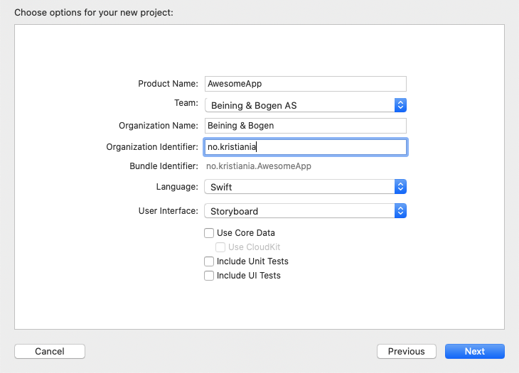

---

# Asset catalogs

Consists of image sets / icons / launch icons, and the different icon variants used on different devices

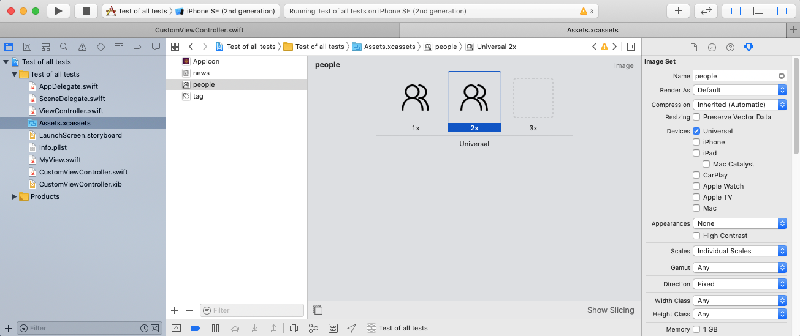

---

# Asset catalogs (Cont'd)

* Images can be loaded from code with: `UIImage (named: "ocean")`
* Images can be set from the Interface builder, for example, by creating a UIImageView that you then put the image into it

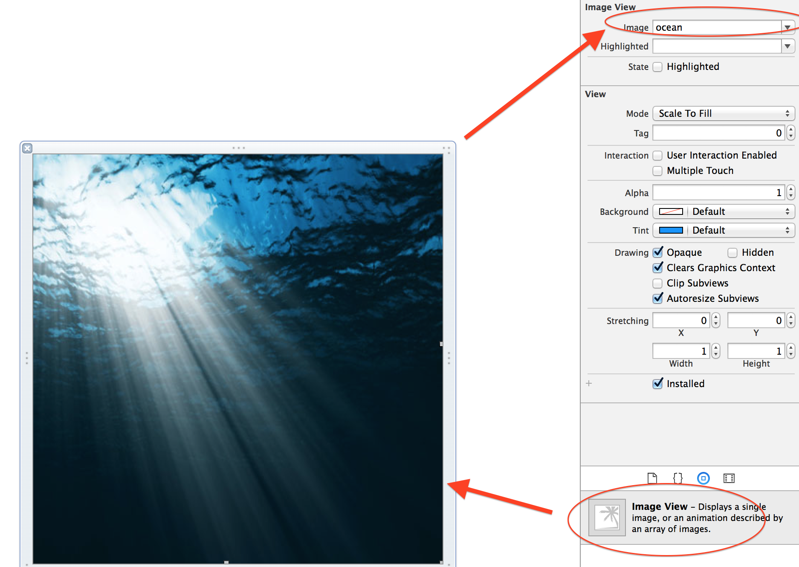

---

# App icon


Search for "Icon and Image Sizes" in the documentation for an overview of sizes and requirements

---

# Main Documentation

* Apple docs (XCode -> Help -> Developer Documentation):
    * The App Life Cycle
    * UIView Programming Guide for iOS
    * UIViewController Programming Guide for iOS

---

# Main Documentation (Cont'd)

1. CMD-click on a symbol to open quick help
2. Click on the link in "Reference" to go to class reference

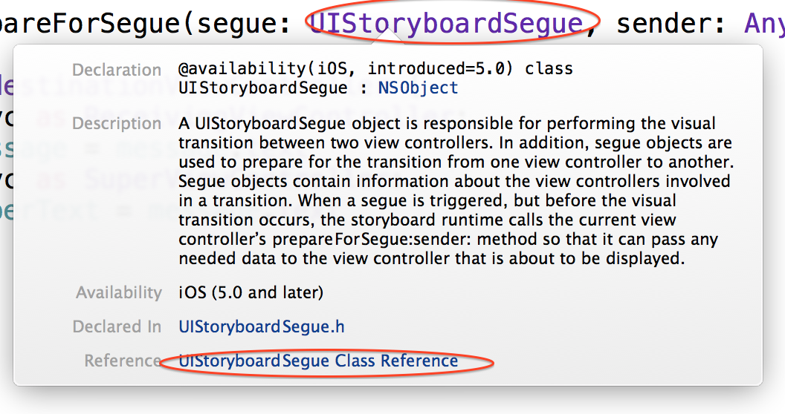

---

# Main Documentation (Cont'd)

1. Put the cursor on a symbol
2. Choose quick help in the inspector

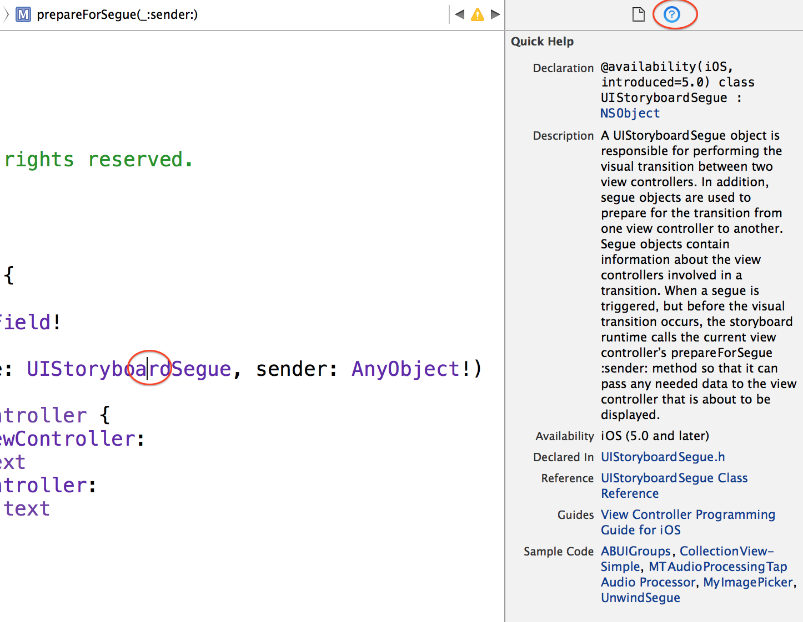

---

# Components of an iOS app

---

# Overview


---

# UIApplication

* Each app has exactly one (singleton), which is created by UIApplicationMain
* Accessible with `UIApplication.shared`
* Handles event loop and high-level functionality
* Informs about state transitions and events via the app delegate, which is the place you have the opportunity
to handle these

---

# App delegate

* Goes hand in hand with UIApplication, and is the place where you handle app events
* App initialisation (items, views, initial data)
* Handles state transitions
* Handles high-level app events (ex. Push notifications)

---

# UIWindow

* Usually only one, unless you have content on multiple screens
* Not directly manipulated. Instead, you use View Controllers, which updates the views displayed in UIWindow

---

# View Controllers

Manages a view and its subviews, coordinates events and communication between models and views


---

# View Controllers (Cont'd)


---

# Views

* Draws content on the screen
* Responds to events
* UIKit contains standard views (labels, text fields, tables, etc.)
* You can subclass UIView to create custom views

---

# Launch flow

# Launch

```swift
// @UIApplicationMain calls UIApplicationMain () and uses this class as the app delegate
@UIApplicationMain
class AppDelegate: UIResponder, UIApplicationDelegate {
    var window: UIWindow?

    func application(_ application: UIApplication, didFinishLaunchingWithOptions launchOptions: [UIApplicationLaunchOptionsKey: Any]?) -> Bool {
        // Automatically this happens:
        // - UIWindow is created
        // - Main storyboard is loaded
        // - Initial VC from storyboard is set on UIWindow
        // - Displays the window
        return true
    }
}

```

More info [1](https://developer.apple.com/library/prerelease/ios/documentation/Swift/Conceptual/Swift_Programming_Language/Attributes.html) & [2](http://oleb.net/blog/2012/02/app-launch-sequence-ios-revisited/)

---

# Application lifecycle

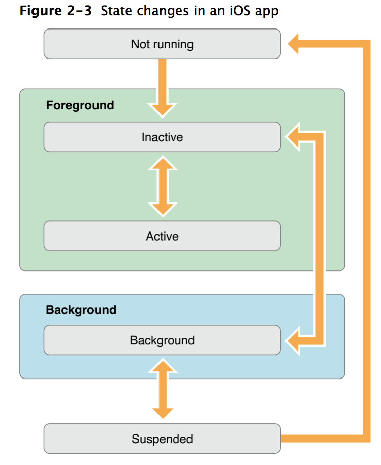

* __Inactive__: In the foreground, but does not receive events (e.g. on an incoming call)
* __Active__: Normal state. In the foreground and receives events
* __Background__: Ability to run some background operations (e.g. audio) / When launching in background (e.g. background fetch, push)
* __Suspended__: In memory, but no code runs

---


* Apps are expected to start in a maximum of 5 seconds, otherwise the app may be terminated.

---


* Can request more time for some tasks with `beginBackgroundTaskWithExpirationHandler:`

---

# MVC

* Views: buttons, text fields and other components visible to the user
* Models: holding onto data. Ex. arrays, dictionaries. Have no knowledge of views
* Controllers:
    * can receive events from views
    * Can update models
    * Can update views from model data

---

# MVC (Cont'd)

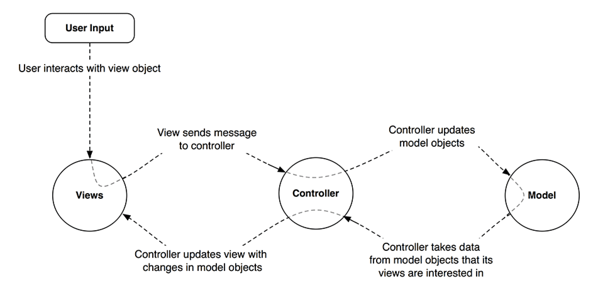

Photo: The Big Nerd Ranch Guide, Chapter 1

---

# View Controllers


---

# View Controllers (Cont'd)

* __You never set views directly on UIWindow yourself.__ Instead, you set a view controller on UIWindow, which in turn will add your views to the window
* View controllers and resource management:
    * Only loads its view when needed
    * Can deallocate the view, e.g. at low memory

---

# View Controllers (Cont'd)

* View Controllers will typically only know part of the application and will therefore communicate with other view controllers
* Views send messages to their VC. For example, when you press a UIButton it can send a message to its VC, which defines what should happen

---

# View Controllers (Cont'd)

* Content view controllers: "common" view controllers you define to view / retrieve user data
* Container view controllers: contains other view controllers, eg. UINavigationController, UISplitViewController

---

# Navigation Controller


---

# Split View Controller


---

# Nested view controller


---

# Loading views into memory

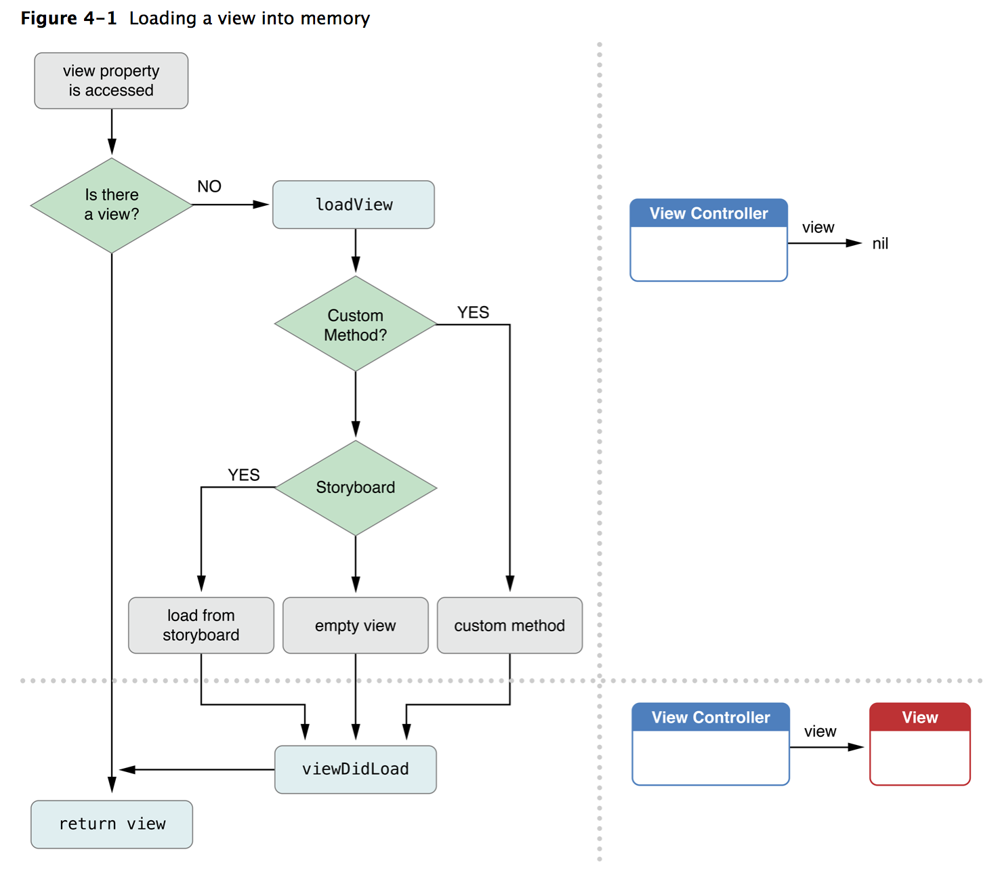

---

# Ways to set up views and view controllers


* XIB
* Storyboards


---

# XIB step by step example


---

# XIB step by step example (Cont'd)


---

# XIB step by step example (Cont'd)


---

# XIB step by step example (Cont'd)

Connect view and view controllers via the assistant editor


---

# Connect views and view controllers together

* Outlets - references to UI elements from code (manipulate / extract values)
* Targets - references from UI to code (calling methods)

---

# Connect views and view controllers together (Cont'd)

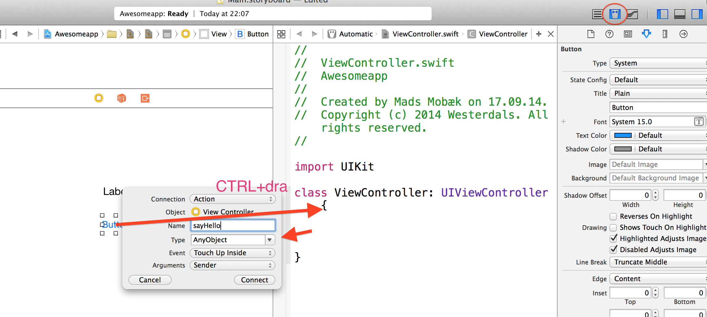

---

# Connect views and view controllers together (Cont'd)


---

# Connect views and view controllers together (Cont'd)


---

# Connect views and view controllers together (Cont'd)


---

# Connect views and view controllers together (Cont'd)

Finished example: action sayHello is called when the button is pressed and sets the value to label (outlet)

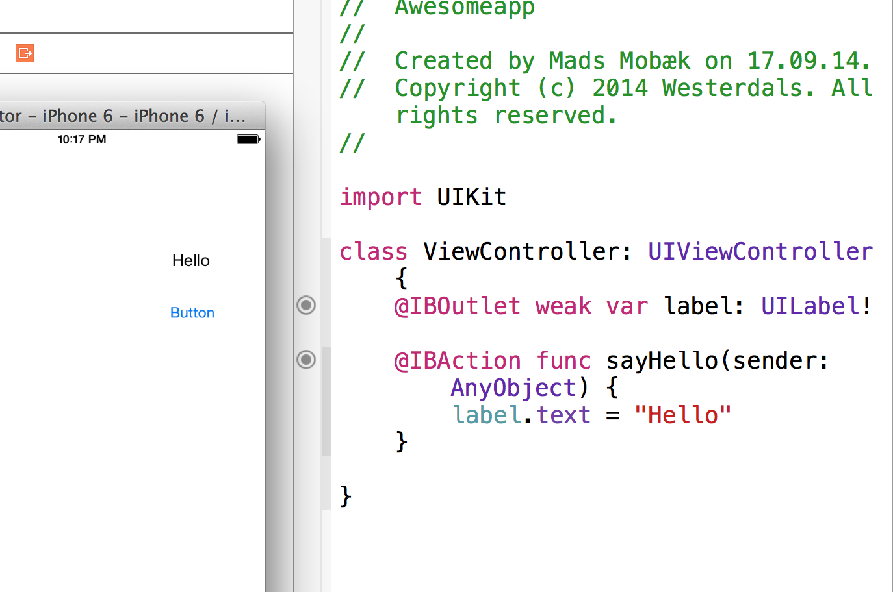

---

# XIB example

```swift
 	let viewController = UIViewController(nibName: "CustomViewController", bundle: NSBundle.mainBundle())
 	let nib = NSBundle.mainBundle().loadNibNamed("myView", owner: self, options: nil)
 	let view = nib.firstObject as? UIView
```

---

# nibName? Wasn't it an XIB?

XIB (pronounced zib) and storyboards are compiled to NIB:

> The contents of .xib and .storyboard files are stored by XCode in XML format. To save time, XCode compiles your .xib and .storyboard files into binary files known as nibs. At runtime, nibs are loaded and instantiated to create new views.

---

# Storyboards

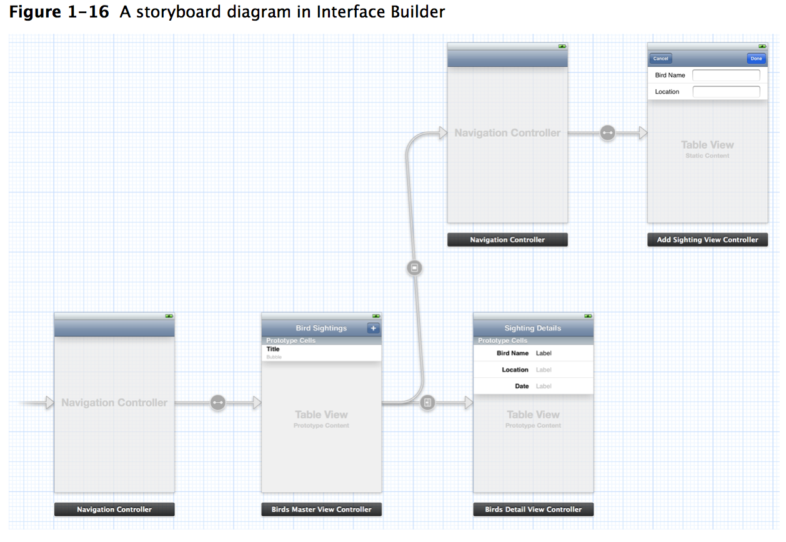

---

# Storyboards (cont'd)

* The default way to layer views
* Can give you an overview of the flow in the application
* Enables drag'n'drop to connect view controllers (called segues)
* View controllers are automatically instantiated with the values from the interface builder when needed

---


# Storyboard example

1. Open `Main.storyboard` and create GUI in the same way as with XIB
2. Update `application: didFinishLaunchingWithOptions:` to

```swift
func application(application: UIApplication,
    didFinishLaunchingWithOptions launchOptions: [NSObject: AnyObject]?) -> Bool {
    return true
}
```

----


# Storyboard example (Cont'd)

3. Insert Main interface into the project:

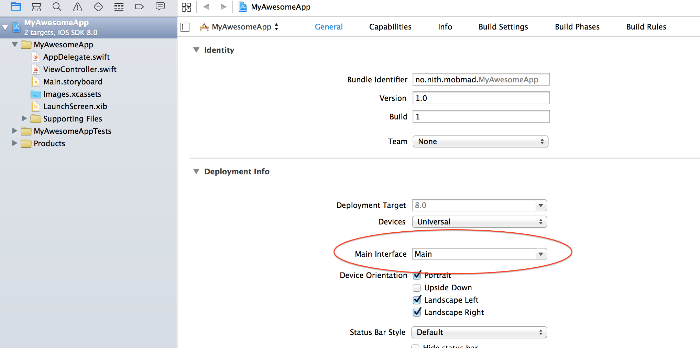

----


# Creating multiple view controllers in storyboard

1. Drag and drop the "View Controller" into the Object Library storyboard:
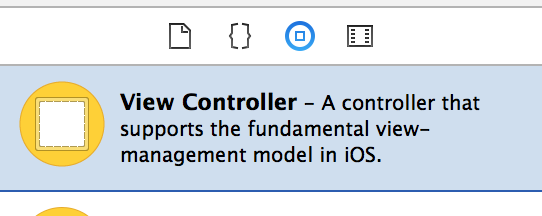

2. File -> New -> File -> Cocoa Touch, subclass of UIViewController

---

# Creating multiple view controllers in storyboard

3. Pair the view controller object in the storyboard with its actual class (from step 2)


---

# Communication between the view controller


---

# Communication between the view controller (Cont'd)

* Destination controller: exposes data / presentation properties
* Source: puts properties on the destination controller before it is displayed
* When the destination controller needs to communicate back, this is done via a delegate specified by the source. Therefor, the destination controller does not have direct knowledge of its parents

---

# Communication between the view controller (Cont'd)


---

# Communication between the view controller (Cont'd)


---

# Communication between the view controller (Cont'd)

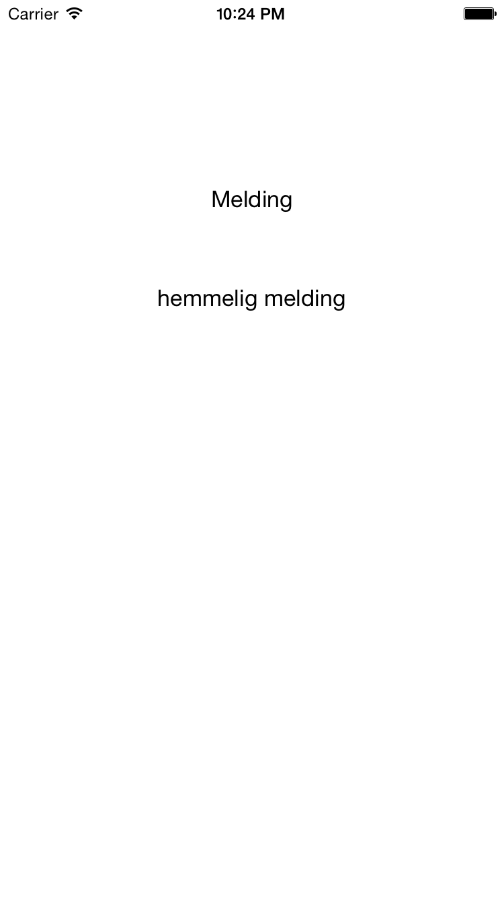

---

# Communication between the view controller - alt 1

```swift
import UIKit

class ViewController: UIViewController {

    // Reference to the input field
    @IBOutlet weak var messageTextField: UITextField!

    // Called when you press "Send Message"
    @IBAction func didTapSendMessageButton(sender: AnyObject) {
        // Instantiates new vc from storyboard manually
        // Normally, we let the storyboard do this for us. See alt 2. later.
        if let receivingViewController = storyboard?.instantiateViewControllerWithIdentifier("receivingVC")
            as? ReceivingViewController {
            // Sets property at destination vc before it appears
            receivingViewController.message = messageTextField.text!

            presentViewController(receivingViewController, animated: false, completion: nil)
        }

    }

}
```

---

# Communication between the view controller - alt 1

The connections inspector should look like this:


---

# Communication between the view controller - alt 1

```swift

// The second view controller
class ReceivingViewController: UIViewController {
    // This must be set by the parent view controller
    var message: String?

    @IBOutlet weak var messageLabel: UILabel!

    // Configures the view after it is loaded into memory
    // Works both for views loaded from nib (storyboard / xib)
    // and for those made with pure code (loadView :)
    override func viewDidLoad() {
        super.viewDidLoad()

        messageLabel.text = message
    }

}
```

---

# Communication between the view controller - alt 1

The Connections inspector should look like this:

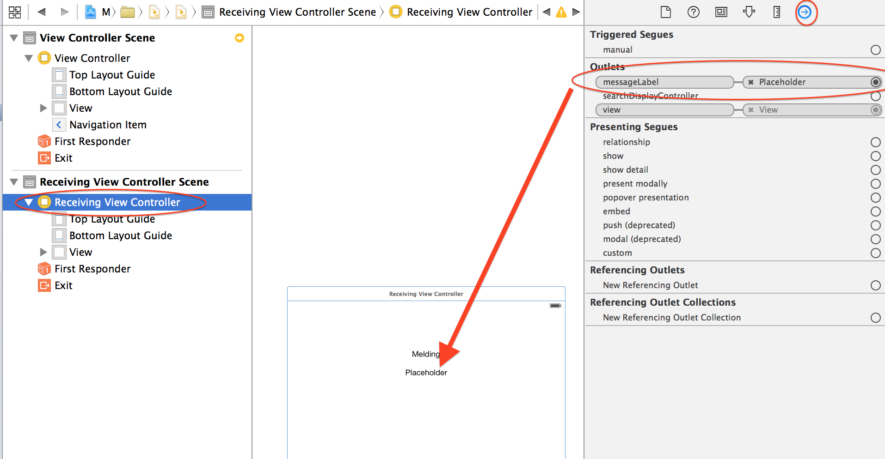

---

# Yay!
## But is there an easier way?

---

# Storyboard and segues

Can make connections between view controllers with drag'n'drop in storyboard. These transitions are called segues.


---

# Communication between the view controller - alt 2

```swift
// Only this view controller is updated. ReceivingViewController is unchanged
class ViewController: UIViewController {

    @IBOutlet weak var message: UITextField!

    // Called before transition
    override func prepareForSegue(segue: UIStoryboardSegue, sender: AnyObject!) {
        if let vc = segue.destinationViewController as? ReceivingViewController {
            vc.message = message.text
        }

    }
}
```

---
# Further reading

-  Stanford iOS Development Lecture 2
-  https://developer.apple.com/library/archive/referencelibrary/GettingStarted/DevelopiOSAppsSwift/index.html

---
