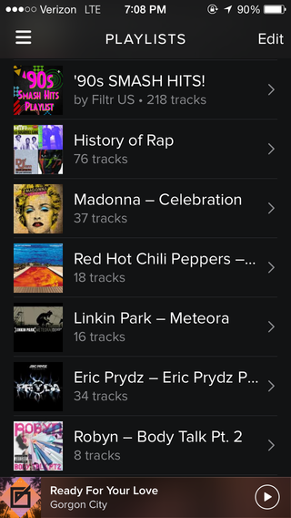
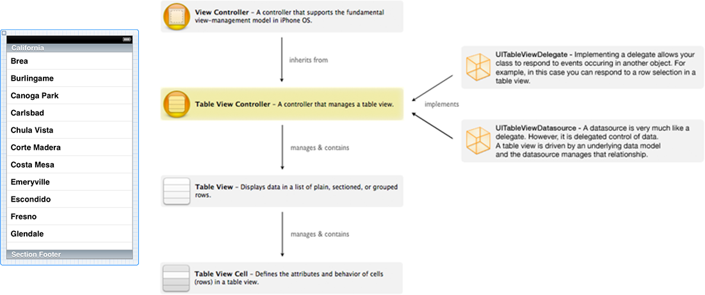
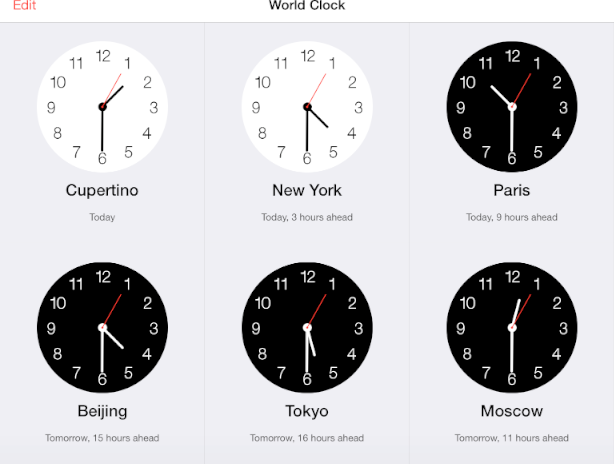
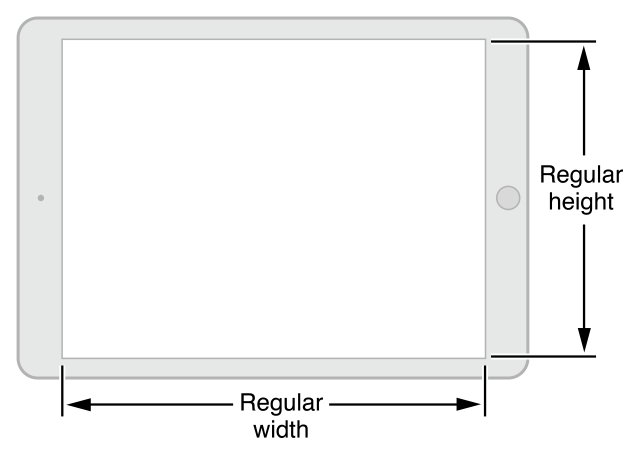
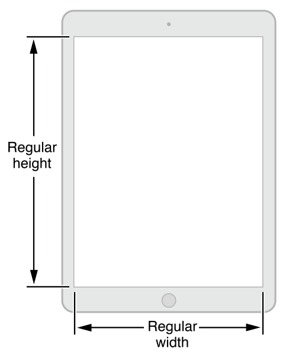
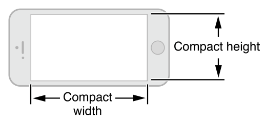

# PG5600
# iOS programmering
## Lesson # 5

---

# Review

* Set up a new iOS project in XCode
* Components of an iOS app
* Launch flow
* Application lifecycle
* MVC
* UIView & UIViewController

---

# Agenda

* Delegate pattern
* UINavigationController
* UITableView & UITableViewController
* UICollectionView & UICollectionViewController
* Auto Layout
* Unified Storyboard & Size classes

---

# Delegate pattern

* Design pattern to get an object to delegate parts of its tasks to another object
* The delegating object holds a reference to another object called the delegate
* The delegating object calls one or more methods on the delegate
* Delegate patterns are widely used in Cocoa Touch

---

# Delegate pattern (Cont'd)


---

# Delegate pattern (Cont'd)

What is needed?

---
# Delegate pattern (Cont'd)

1: A protocol

```swift
protocol DataHandlerProtocol {
    func didFinishGetting(data: NSData)
    func didFailGettingData(error: NSError)
}
```

---
# Delegate pattern (Cont'd)

2: A delegate that implements the protocol

```swift
class A : DataHandlerProtocol {
    func didFinishGetting(data: NSData) {
        print(data)
    }

    func didFailGettingData(error: NSError) {
        print(error)
    }
}
```

---
# Delegate pattern (Cont'd)

3: A delegating object

```swift
class Fetcher {
    var delegate: DataHandlerProtocol?

    func fetch() {
        delegate?.didFinishGetting(NSData())
    }
}
```

---

# Delegate pattern (Cont'd)

Delegate-pattern is used by a lot of classes, some of the well known ones are:

- UINavigationController
- UITableView
- UICollectionView

---

# UINavigationController


* One of the standard components
* Keeps a collection of UIViewController's
* A UINavigationController coordinates navigation between UIViewController's
* In addition to navigation, it is also responsible for a UINavigationBar and a UIToolbar

---

# UINavigationController (Cont'd)

Note that:
- A UINavigationController keeps a collection of UIViewController's
- A UIViewController (not UINavigationController) keeps a collection of views

---

[.background-color: #FFFFFF]


---

# UINavigationController (Cont'd)

UIViewController is handled by UINavigationController by:

* Push & pop UIViewController on/off the UINavigationController view stack
* When a view is pushed, the new one comes in from the right
* When a view is popped, the view leaves to the right
* If you use storyboard, all this will be handled automatically
* If you use XIB files or just code then you have to implement the push/pop yourself

---

# UINavigationController (Cont'd)


---

# UINavigationController (Cont'd)

Can I do it in code?

```swift
    # Presents a modal
    let rootViewController = UIViewController()
    var navigationController = UINavigationController(rootViewController: rootViewController)
    present(navigationController, animated: true, completion: nil)
```

---

# Push & pop

```swift
var viewController = UIViewController()
navController.pushViewController(viewController, animated: true)
navController.popViewController(animated: true)
```

---

# UIButton & UINavigationBar

```swift
class ViewController: UIViewController {
    override func viewDidLoad() {
        super.viewDidLoad()

        var rightButton = UIBarButtonItem(
          barButtonSystemItem: .add,
          target: self,
          action: #selector(buttonTouched:)
        )

        self.navigationItem.rightBarButtonItem = rightButton;
    }

    func buttonTouched(sender: AnyObject) {
        self.navigationController?.pushViewController(ViewController(), animated: true)
    }
}
```

---

# UILabel/Title & UINavigationBar

```swift
class ViewController: UIViewController {
    override func viewDidLoad() {
        super.viewDidLoad()

        self.navigationItem.title = "Test title"
    }
}
```

---

#  UITableView & UITableViewController

Some uses include:

* Navigating hierarchical data
* Presenting a list of elements
* Display detailed information and controls in visual groupings
* View selectable options

---

### Spotify



---

### Peek


---

### Airbnb


---

# Features and Content

* Each row consists of a UITableViewCell
* Comes with some pre-defined designs (can make custom designs too)
* Can respond to tapping on a cell
* Has implemented editing capabilities:
 * Add
 * Remove
 * Reorganize

---



---

# But how to put data before navigating? From the previous view controller!

```swift
// remember this?
if let vc = destinationViewController as? ReceivingViewController {
    vc.message = message.text
}
```

---

# UICollectionView


* Is a more flexible alternative to UITableView
* Changes are made using subclassing
* You can implement grid, stack, circular layout
* Or anything else you can cook up

---



---


---

# UICollectionViewController components

1: UICollectionView

Main view containing all the other views. This is very similar to UITableView

---

# UICollectionViewController components (Cont'd)

2: UICollectionViewCell

Like UITableViewCell in UITableView. Cells can be created programmatically or via the interface builder (IB)

---

# UICollectionViewController components (Cont'd)

3: Supplementary Views
You can add multiple views that are not cells
This is typicaly views at the top and bottom (header and footer)

---

# UICollectionViewController components (Cont'd)

4: Decoration View

Views that add no functionality, but are intended to make the collection view visually more beautiful

---

# UICollectionViewController components (Cont'd)

5: UICollectionViewLayout

Determines how the layout of the cells should be

Layout can be replaced runtime

---

#  UICollectionViewFlowLayout

Apple has created a custom layout that comes with collection views

---


---

#  Auto Layout

* Build your user interface based on a set of rules
* You define the rules using Auto Layout
* The goal is to create a dynamic interface that responds to changes in size, orientation and location (language)
* Auto Layout is built into the Interface Builder

---

#  Auto Layout (Cont'd)

* Constant value - The physical size or offset in the number of points for the rule
* Relational - Use relationships and greater than, less than or equal to specify, for example, that a view's width >= 20, or that a textview.leading >= (superview.leading + 20).
* priority Level - Rules can have priority, so some may be less imporant than others. The priority set to max by default

---

# Interface builder, point and click

<br />
<br />


---

# Programmatically

```swift
// Visual Format Language
let views = ["button1": UIButton(), "button2": UIButton()]
var constraints = NSLayoutConstraint.constraints(
  withVisualFormat: "[button1]-[button2]",
  options: NSLayoutFormatOptions.AlignAllBaseline,
  metrics: nil,
  views: views
)
```

---
# Alternatives are also available (not part of the course)

- https://github.com/robb/Cartography
- https://github.com/PureLayout/PureLayout
- https://github.com/SnapKit/Masonry

It's recommended to do autolayout in storyboard

---

# Enable and disable on NSLayoutConstraint

```swift
    var active: Bool

    class func activateConstraints(constraints: [AnyObject])

    class func deactivateConstraints(constraints: [AnyObject])
```

---

# Potential problems

* Missing of rules
* The view in the inferface builder is placed somewhere else the rules will place it
* Conflicts
* Ambiguity - when there are multiple solutions for a view based on the rules

---

#  Demo
Constraints & Interface Builder

---

# View debugging, press pause

---

#  Unified Storyboard & Size classes

What is it?

A way to make it easier to support multiple screen sizes

---

# Unified Storyboard & Size classes (Cont'd)

Why?

Apps should adapt to changing orientation and screen size to provide a better user experience

---

# Size classes

* Regular - Represents a lot of screen space
* Compact - Represents little screen space

---

# Size classes (Cont'd)


---

# Size classes (Cont'd)




---

# Size classes (Cont'd)




---

# Further reading

- Chapter 6 i iOS 8 Swift Programming Cookbook
- View Controller programming guide - Apple docs
     - The adaptive model
