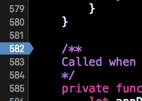
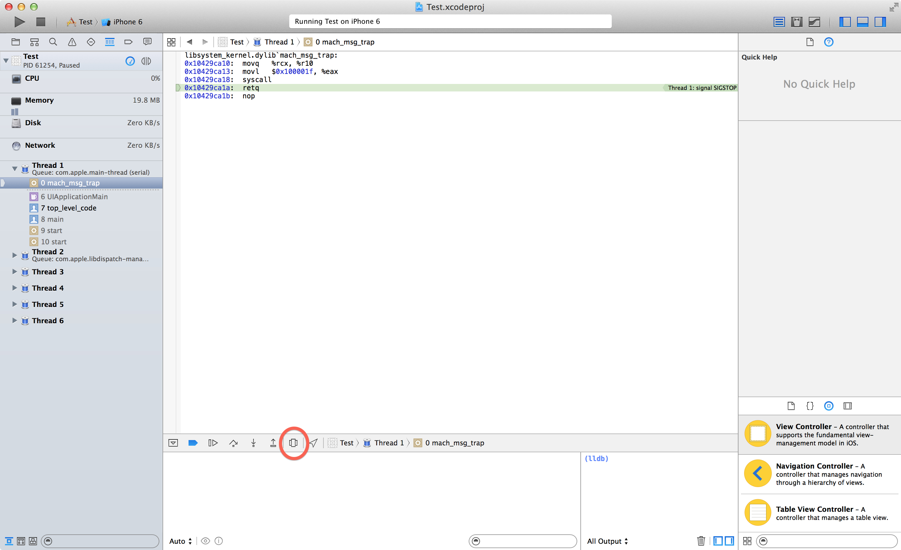

# PG5600
# iOS programming
## Lecture 7

---

# Last time

* View concepts
* Instantiating views
* Custom views
* Events
* Gestures
* Animations

---

# Agenda

* Debugging
* Testing
* Swift and code reuse
  * Framework
  * Cocoapods, Carthage, and SPM
* Threads and asyncronicity
* Web requests
* Try & json


---

# Debugging

* Breakpoints
* Logging
* Unit tests
* Assertions (or force unwraps)


---

#Debugging

## Breakpoint Logging

---



---


---

# Logging

```swift


// console i XCode
print("Logg en linje")

// Device console (can be shown in console of device, without xcode)
NSLog("Logg objekter")

```

---

# NSLogger
##### https://github.com/fpillet/NSLogger

---


---

```swift

import NSLogger

[…]

// logging some messages
Logger.shared.log(.network, .info, "Checking paper level…")

// logging image
Logger.shared.log(.view, .noise, myPrettyImage)

// logging data
Logger.shared.log(.custom("My Domain"), .noise, someDataObject)
//Swell.plist for å konfigurere
```

---

# Unit tests

```swift
import XCTest
import SwiftFonts

class FontSorterTests: XCTestCase {

    let sorter = FontSorter()

    func testCompareHyphenWithNoHyphen() {
        let fonts = ["Arial-ItalicMT", "ArialMT"]
        let expected = ["ArialMT", "Arial-ItalicMT"]
        let sorted = sorter.sortFontNames(fonts)
        XCTAssertEqual(expected[0], sorted[0], "the array should be sorted properly")
        XCTAssertEqual(expected[1], sorted[1], "the array should be sorted properly")
    }

    func testCompareHyphenWithHyphen() {
        let fonts = ["Avenir-Roman", "Avenir-Oblique"]
        let expected = ["Avenir-Oblique", "Avenir-Roman"]
        let sorted = sorter.sortFontNames(fonts)
        XCTAssertEqual(expected[0], sorted[0], "when two fonts contain a hyphen, they should be sorted alphabetically")
        XCTAssertEqual(expected[1], sorted[1], "when two fonts contain a hyphen, they should be sorted alphabetically")
    }
}

```

---

# XCode test assertions

```swift
XCTAssert(expression, format...) // if expression = true, test is OK

XCTAssertTrue(expression, format...) // same as above

XCTAssertFalse(expression, format...) // if false, test is OK

XCTAssertEqual(expression1, expression2, format...) // if equal, test is OK

XCTAssertNotEqual(expression1, expression2, format...) // if not equal, test is OK

XCTAssertEqualWithAccuracy(expression1, expression2, accuracy, format...) // for numbers that don't have to be 100% alike

XCTAssertNotEqualWithAccuracy(expression1, expression2, accuracy, format...) // for numbers that don't have to be 100% alike

CTAssertNil(expression, format...) // test optionals

XCTAssertNotNil(expression, format...) // test optionals
```

---

# Async testing

```swift
func testAsynchronousURLConnection() {

    let url = "http://mobile-course.herokuapp.com/message"
    let expectation = expectationWithDescription("GET \(URL)")

    let session = URLSession.shared
    let task = session.dataTask(with: URL(string: url)!, completionHandler: {(data, response, error) in
        expectation.fulfill()

        XCTAssertNotNil(data, "data should not be nil")
        XCTAssertNil(error, "error should be nil")

        if let HTTPResponse = response as? HTTPURLResponse {
            XCTAssertEqual(HTTPResponse.url?.absoluteString, url, "HTTP response URL should be equal to original URL")
            XCTAssertEqual(HTTPResponse.statusCode, 200, "HTTP response status code should be 200")
            XCTAssertEqual(HTTPResponse.mimeType as String?, "application/json", "HTTP response content type should be text/html")
        } else {
            XCTFail("Response was not NSHTTPURLResponse")
        }
    })

    task.resume()

    waitForExpectationsWithTimeout(task.originalRequest.timeoutInterval, handler: { error in
        task.cancel()
    })
}
```


---

# Performance testing

```swift

func testPerformanceExample() {
    // Testing performance with self.measureBlock
    self.measureBlock() {
        // Time the stuff here
    }
}

```

---

# Code level assertions

* Optionals for values that *have* to be present for the app to run
* Crashing the app is better than user getting stuck
* Remember to run through the app before release though!

---
### Force unwraps
```swift

@IBOutlet weak var UILabel titleLabel!

```

### Normal assertion (not widely used)

```swift

assert(age > 13, "Registered age is not above 13")

```

---

# NB remember this common mistake!

```swift

let myArray = ["aString", "anotherString"]

let value = myArray[3]

💥💥💥💥💥💥💥💥💥💥💥

```

---

## Debugging
# View
Pause the app while running

---



---

## Debugging
<br />
# Playground

Debug small functions or views

---
# Code reuse / frameworks


* Import files directly
* Cocoapods
* Carthage
* Swift Package manager

---

# Frameworks

* Makes it  easier to reuse code
* Good for an app with many targets
* Remember public / private / internal

---

# Async

---

- Main thread can draw GUI
- Use other threads for big calculations
- Different options for making threads
  - NSThread
  - Grand Central Dispatch
  - NSOperationQueue

---


# Grand Central Dispatch

- Creates the threads for you
- Based on queues of tasks
- Two types of tasks
  1. Serial - One task at a time
  2. Concurrent - Can perform several tasks

```swift
 DispatchQueue.init(label: "another thread").async {
   /// Do stuff

   // Back to main thread!
   DispatchQueue.main.async {
     // draw images, update GUI
   }

}

```

---
# NSThread

* Not widely used

```swift
// Lag en ny tråd
Thread.detachNewThreadSelector("someMethod", toTarget: self, withObject: nil)

var thread = Thread(target: self, selector: "testMethod", object: nil)
thread.start()
thread.cancel()
```
---

# NSOperation, NSOperationQueue

* One unit of work
* Abstract class you inherit from

Alternativer
NSBlockOperation - Create a closure that runs in a thread
NSInvocationOperation - Runs a function in a thread

---

# Starting an NSOperation

```swift

var operation = Operation()
operation.start()

operation.cancel()


```
<br />

---

# Put in NSOperationQueue

* Runs a set of NSOperation, NSBlockOperation or NSInvocationOperation
* First-In-First-Out as a standard
* Set max concurrent tasks with `maxConcurrentOperationCount`
* Uses Grand Central Dispatch

---
<br />

- `QOS_CLASS_USER_INTERACTIVE` = NSQualityOfServiceUserInteractive
- `QOS_CLASS_USER_INITIATED` = NSQualityOfServiceUserInitiated
- `QOS_CLASS_UTILITY` = NSQualityOfServiceUtility
- `QOS_CLASS_BACKGROUND` = NSQualityOfServiceBackground

---

```swift

let backgroundOperation = Operation()
backgroundOperation.qualityOfService = .background

let operationQueue = OperationQueue()
operationQueue.addOperation(backgroundOperation)

```

---

# NSThread vs GCD vs NSOperationQueue

- GCD for easy use, day to day usage
- NSThread if you need full control
- NSOperationQueue if you need to set queues with max tasks, specific ordering etc.

---

# Web requests


---

# Http methods

GET - Get data

POST - Send data

PUT - Update data

PATCH - Update some fields only

DELETE - Delete data

---

```swift
let url = URL(string: "http://ip.jsontest.com")!
let session = URLSession.shared
let task = session.dataTask(with: url, completionHandler: { (data, response, error) -> Void in
    print(data)
})

task.resume()

```

```swift
let url2 = URL(string: "http://mobile-course.herokuapp.com/message")!
var request2 = URLRequest(url: url2)
request2.httpMethod = "POST"
let session2 = URLSession.shared
let task2 = session2.dataTask(with: request2, completionHandler: { (data, response, error) -> Void in
    print(data)
})

task2.resume()

```

---

# Playground og Nettverk

For å kjøre asynkron kode i playground må man gjøre følgende

```swift
import XCPlayground
XCPSetExecutionShouldContinueIndefinitely()
```

---

# Alamofire og REST
## https://github.com/Alamofire/Alamofire

---

```swift

Alamofire.request(.GET,  "http://jsonplaceholder.typicode.com/posts")
            .responseJSON { ( response) -> Void in

                if let responseJSONArray = response.result.value as? [[String : AnyObject]] {

                    for post in responseJSONArray {
                        print(post)
                    }
                }

                if let responseError = response.result.error {
                    print(response.result.error)
                }
        }

```

---


# try


---

```swift

    func testStuff() {
        do {
            try login()
        } catch LoginError.NoUserName {
            print("wrong username")
        } catch LoginError.WrongPassword {
            print("wrong password")
        } catch {
            print("some other error")
        }
    }


```

---
# Try

```swift

    enum LoginError: Error {
        case NoUserName
        case WrongPassword
    }

    func login() throws {
        defer {
            print("an error happened")
        }

        let userText : String? = "John Snow"
        let passWordIsCorrect = false

        guard let actualUserName = userText else {
            throw LoginError.NoUserName
        }

        guard passWordIsCorrect else {
            throw LoginError.WrongPassword
        }
    }        

```


---


# Force Try!


```swift

// crash if error
try! login()


```
---

# JSON
# Swift 3

```swift
func titlesFromJSON(data: NSData) -> [String] {
    var titles = [String]()
    
    do {
        let jsonDictionary = try JSONSerialization.JSONObjectWithData(data, options: nil, error: &jsonError) as? [String : AnyObject] {
            guard let feed = jsonDictionary["feed"] as? [String : AnyObject] else {
                // throw ?
            }
            
        }
    } catch let error as NSError {
        // Do something with error
    }
    
    return titles
}
```
---

# Find name

```swift
struct Movie {
  let name: String
  let genre: String?
  let year : Int
  let rating: Double

  init?(attributes: [String : Any]) {

    guard let name = attributes["name"] as? String, let year = attributes["year"] as? Int, let rating = attributes["rating"] as? Double else {
      return nil
    }
      self.name = name
      self.genre = attributes["genre"] as? String
      self.year = year
      self.rating = rating
  }
}

let jsonDict  = JSONSerialization.JSONObjectWithData(data,
  options: NSJSONReadingOptions.MutableContainers, error: nil) as? [String : Any]

Movie(attributes: jsonDict)


```
---

#Swift 4

```Swift
struct Movie : Decodable {
    let name: String
    let genre: String?
    let year : Int
    let rating: Double

    enum Keys: String, CodingKey {
        case name
        case genre
        case year
        case rating
    }

    public init(from decoder: Decoder) throws {
        let container = try decoder.container(keyedBy: Keys.self)
        self.name = try container.decode(String.self, forKey: Keys.name)
        self.rating = try container.decode(Double.self, forKey: Keys.rating)
        self.year = try container.decode(Int.self, forKey: Keys.year)
        self.genre = try container.decode(String?.self, forKey: Keys.genre)
    }

}

```
---

```Swift
let json =
"""
{ "name" : "Matrix",
"genre" : "Sci-fi",
"year" : 2003,
"rating" : 9.8
}
"""

let movie = try JSONDecoder().decode(Movie.self, from: json.data(using: String.Encoding.utf8)!)
```
---

# Videre lesning


- https://github.com/ochococo/Design-Patterns-In-Swift
- http://www.raywenderlich.com/79149/grand-central-dispatch-tutorial-swift-part-1
- Error handling i boka
- Basics i iOS-boka
- Cocoapods.org


---

# Oppgaver

## Se GitHub
