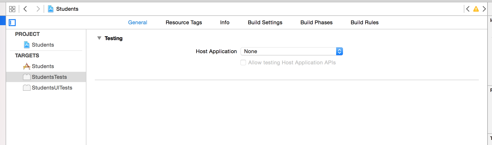
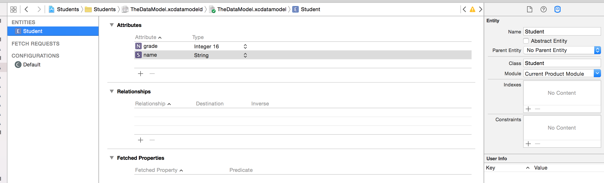

# PG5600
# iOS programmering
## Forelesning 9 - Mer om MVC, persistering og testing

---

## Last ned repoet for denne forelesningen:


### https://github.com/haaakon/Demo-Students/

Vi ser på dette gjennom hele forelesningen


---

# Sist gang

* Hvor filer lagres
* Enkel lesing og skriving til disk
* NSUserDefaults
* NSKeyedArchiver / NSKeyedUnarchiver
* Core Data
* Keychain

---

# I dag


* Custom Views og MVC
* Protokoller og protocol extension
* Tips til å skrive tester
* Skrive tester for Persistering
* Skrive tester for JSON-parsing

---

# Hvordan teste at data vises på riktig måte?

[Demo av viewet vi skal lage]

---

# Lag datasource for viewet

Dette vil gjøre det enklere å beholde MVC-patternet

```swift

@objc
protocol StudentSummaryViewDataSource {
 	func numberOfStudents(studentSummaryView: StudentSummaryView) -> Int
}


class StudentSummaryView : UIView {

	 @IBOutlet weak var numberOfStudentsLabel : UILabel!

 	 weak var dataSource : StudentSummaryViewDataSource?


}

```

---

# Inspirert av Apple


Fra UITableView i UIKit:


```swift

public protocol UITableViewDataSource : NSObjectProtocol {

     optional public func numberOfSectionsInTableView(tableView: UITableView) -> Int

	 weak public var dataSource: UITableViewDataSource?

	 public func tableView(tableView: UITableView, cellForRowAtIndexPath indexPath: NSIndexPath) -> UITableViewCell

	 ...

     }

 ```

---

#Vise data i viewet:

 ```swift


  func reloadData() {
        if let numberOfStudents = dataSource?.numberOfStudentsInStudentSummaryView(self) {
            numberOfStudentsLabel.text = "\(numberOfStudents) studenter"
        } else {
            numberOfStudentsLabel.text = "?"
        }
    }

  ```

---

# Hvem skal være dataSource?


 - MVC -> Controller er mellommann mellom Model og View

 - Men i iOS blir ofte ViewController mellommann for alt for mye, og er vanskelig å skrive tester på.

 - Vi lager en egen klasse som kun er controller for vårt custom View!


---

# DataSourceController

 ```swift

class StudentSummaryViewDataSourceController : StudentSummaryViewDataSource {

    @objc func numberOfStudents(studentSummaryView: StudentSummaryView) -> Int {
        // TODO: tell opp antall studenter i databasen
        return 0
    }
}

 ```


---

### Vi må hente alle Student-objekter i databasen og telle disse

---
# Protocol


 ```swift

protocol Fetchable {
    static var entityName : String { get }

    static func allObjects(inManagedObjectContext managedObjectContext: NSManagedObjectContext) -> [Self]

}

```

Self = klassen som implementerer protokollen, meget nyttig!

---

# Protocol extensionen

 ```swift

extension Fetchable where Self : NSManagedObject {

    static func allObjects(inManagedObjectContext managedObjectContext: NSManagedObjectContext) -> [Self] {
        let fetchRequest = NSFetchRequest<Self>(entityName: entityName)
        do {
            let results = try managedObjectContext.executeFetchRequest(fetchRequest)
            return results
        } catch {
            print("An error occurred")
            return [Self]()
        }
    }
}


```

---

# Implementasjonen


Kun sette final og implementere entityName så har du allObjects!

 ```swift

 final class Student: NSManagedObject, Fetchable {

    static var entityName = "Student"

}


let students = Student.allObjects(inManagedObjectContext: moc)

 ```

 ---

# Vi lager en test for å finne om det fungerte


 ```swift

func testCreate2Students() {
        let student1 = Student.insertStudentWithName("Erik", inManagedObjectContext: managedObjectContext)

        let student2 = Student.insertStudentWithName("Magnus", inManagedObjectContext: managedObjectContext)

        ModelManager.sharedManager.saveContext()

        let fetchedStudents = Student.allObjects(inManagedObjectContext: managedObjectContext)
        XCTAssertEqual(fetchedStudents.count, 2)
    }


  ```

---

# Noen gotchas

Husk å slette databasen mellom hver test!

 ```swift

 override func setUp() {
        super.setUp()
        let stud = Student.allObjects(inManagedObjectContext: managedObjectContext)


        for student in stud {
            managedObjectContext.delete(student)
        }

    }

 ```

 ---






---

# Vi skriver en test på at datasource leverer det vi forventer


 ```swift


func testSummaryOf2Students() {

        mockInsertStudents(["Per", "Kristina"])

        let studentSummaryViewDataSourceController = StudentSummaryViewDataSourceController()

        let numberOfStudentsShown = studentSummaryViewDataSourceController.numberOfStudentsInStudentSummaryView(StudentSummaryView())

        XCTAssertEqual(numberOfStudentsShown, 2)

    }


 ```

---

# Implementer datasource


 ```swift

@objc func numberOfStudentsInStudentSummaryView(studentSummaryView: StudentSummaryView) -> Int {

        let allStudents = Student.allObjects(inManagedObjectContext: ModelManager.sharedManager.managedObjectContext)

        return allStudents.count

    }

```

---

# Vi ser litt i prosjektet


- Neste steg er å hente Student fra api i json data

---


```swift

func testCreateStudentFromJSON () {
        let wantedName = "Marie Curie"
        let wantedGrade = 5
        let jsonAttributes = StudentsTests.jsonDictionaryFromFile("1Student")

        let student = Student(attributes: jsonAttributes)
        ModelManager.sharedManager.saveContext()

        XCTAssertNotNil(student)

        XCTAssertEqual(student?.name, wantedName)
        XCTAssertEqual(student?.grade, wantedGrade)

        let fetchedStudent = Student.allObjects(inManagedObjectContext: managedObjectContext).first!

        XCTAssertEqual(fetchedStudent.name, wantedName)
        XCTAssertEqual(fetchedStudent.grade, wantedGrade)

    }


```

---

#Negativ test - nil-initializer


```swift

 func testShouldNotCreateStudent() {
        let jsonAttributes = StudentsTests.jsonDictionaryFromFile("1FalseStudent")

        let student = Student(attributes: jsonAttributes)
        ModelManager.sharedManager.saveContext()

        XCTAssertNil(student)

    }


```

---


#Oppsummering

- Vi har automatiserte tester for alle steder i appen vår hvor brukeren kan få vist data
- Vi har spart oss fremtidig tid ved å skrive en protocol extension med default implementation
- Vi har har tester på at APIet vi har fått beskrevet gjør at appen vil oppføre som vi forventer


---


# Oppgaver ligger på IT's learning
