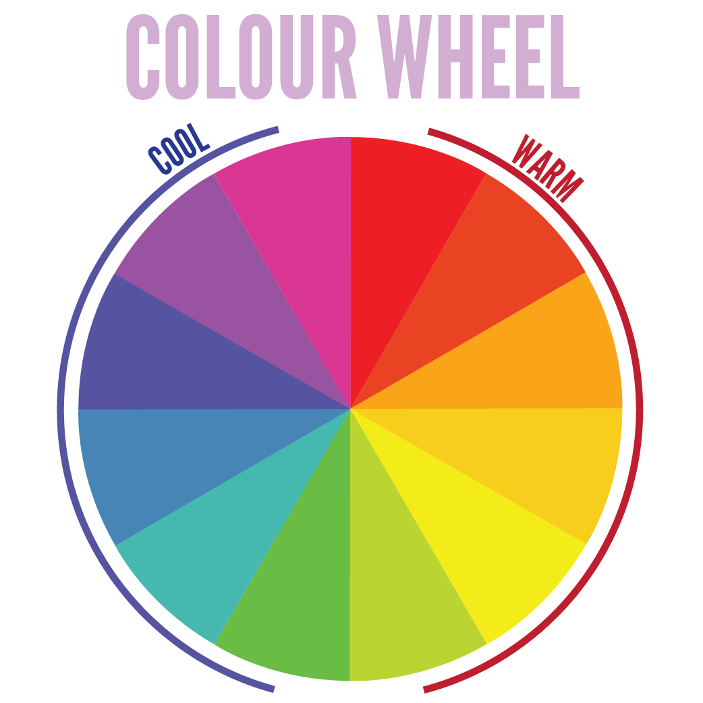

# _PG5600_ iOS-programmering
## Lesson # 1


---

## Benjamin Breiby
## Håkon Bogen

### Beining & Bogen ###
##### beiningbogen.no

---
#Github-repo

```

https://github.com/BeiningBogen/iOS-Kristiania

```

---

# Quick survey

^- Who knows Javascript?
^- Who has heard of swift?
^- Who whas written an iOS app?

---



---

# Agenda

* Practical information
* iOS History
* iOS ecosystem
* XCode
* Swift

---

# Practical information

* The Swift Programming Language
* https://swift.org/
* iOS-programming with Swift - O'Reilly
* A major exam that counts 100%


---

# iOS History

* iPhone OS 1 - 2007
* iPhone OS 2 - 2008 (iPhone SDK)
* iPhone OS 3 - 2009
* iOS 4 - 2010
...
* iOS 13 - 2019
* iOS 14 - Fall 2020

---

# iOS ecosystem

* Portal: _developer.apple.com_
* Devices: _iPhone, iPad, Apple Watch, Apple TV_
* Platforms: _iOS / Cocoa Touch / Objective-C/Swift_
* Development tools: _XCode, Instruments, Bots_
* distribution: _App Store, iTunes Connect_

---

# Xcode 10

* Xcode 11 : https://developer.apple.com/support/xcode/
* Xcode 12 : Coming in September

## DEMO

---

# Swift

---

# But first.... Obj-C

* Objective C was created by NeXT
* Adopted by Apple to develop OS
* Lots of "hugging" [] and ;'s

---

# What is Swift?
* A programming language created by Apple to replace Objective C (used mainly for iOS and OS X)
* It's open source, and seeing increasing use on servers and other platforms
* Modern and powerful - inspired by Python, Ruby, C#

---

# What is Swift? (cont'd)

* Works side-by-side with C and Objective-C
* Object Oriented, Imperative, and Functional

---

# What does it look like?

---

# Write to console

<br>

```swift
			      print("Hello world")

```

---

# Constants and variables

```swift
let schoolName: String = "Høyskolen Kristiania"

var numberOfemployees: Int = 320
numberOfemployees = 500

```

^ Constants are declared with `let` and variables with `var`
It is preferable to use constants and immutable values, unless one has a specific reason as to why the value should be mutable.
By default declare a constant, then change it to a variable if needed.
This will, among other things, make it easier in multi-threading and easier for the compiler. It will also make it easier for other developers to follow the code.

---

# Type inference
```swift
var numberOfemployees = 350
numberOfemployees = 500


let schoolName = "Høyskolen Kristiania"
```

^Type inference is a big feature in Swift. You don't always have to declare the type explicitly.

^But if you set the type, the explicit type overwrites the actual type.
For example, if you explicitally set a `Float` for a `Double`.

^Values will never automatically change type, so if you want to add a String and an Int, you must explicitly convert one of them.

---

# Strings

```swift
let subject = "iOS programmering"

if "iOS programmering" == subject {
    print("I ❤️ " + subject)
}
```

---

# Strings (cont'd)

Oh yeah! You can use emojis as variables 😛

```swift

let 🚀 = "falcon 9 rocket"

```
...but you really shouldn't.

---

# String interpolation

```swift

let n1 = 10, n2 = 8
let mathString = "\(n1) * \(n2) is \(n1 * n2)"
// "10 * 8 is 80"

let 🚀 = "Falcon 9"
print("\(🚀) has just launched") // Falcon 9 has just launched
print("\(🚀.count)")   //  8

```

---

# Numbers

```swift
let integer = 42 // Int
let integer2: Int = 24
let decimal = 13.37
let decimal2: Float = 30.456 // 32 bit precision
let decimal3: Double = 30.456 // 64 bit precision
// Double is the default inferred type
```

---

# Tuples

Group multiple values into one value. Well suited for functions that return multiple values.

```swift
let (x, y) = (50, 300)

let error = (401, "Unauthorized")
print(error.0) // 401
print(error.1) // Unauthorized

// Decomposing the tuple
let (statusCode, message) = error 
print(statusCode) // 401
```

---

#Tuples (cont'd)

```swift

// Named fields in tuples
let error = (code: 401, message: "Unauthorised")
print(error.message) // Unauthorised
// Almost like a class!

```

---

# Optionals

```swift

var userInput: String? = getInputValue()

if userInput == nil {
    print("Du må skrive navnet ditt 😡😡")
} else {
    // Force unwrap with `!`
    let name = userInput!
    print(name)
}
```

^It's okay to know that types that aren't optional can't be nil.
Then you get compile error. Be careful with

---
# Optionals (cont'd)

- http://www.aidanf.net/learn-swift/optionals
- https://learnswiftwithbob.com/course/swift-fundamentals/optionals.html
- http://swift.ayaka.me/posts/2015/10/5/optional
- https://www.youtube.com/watch?v=uT2IHQpE3ms

---

# Optionals (cont'd)

```swift

if let userInput = getInputValue() {
   print(userInput)
} else {
   // Handle a nil value
}

// You can provide a default value with `??`
let userInput = getInputValue() ?? "N/A"
print(userInput)
```

^Automatically unwrapping and putting the value in an if

---

# Ranges

```swift

for n in 1...10 { // 1 through and including 10
    print("\(n) * 2 is \(n * 2)")
}

for n in 1..<10 { // 1 through and including 9
    print("\(n) * 2 is \(n * 2)")
}

```

^1… 10 - Goes from 1 to 10. And is known as a closed range.
 1 .. <10 - Goes from 1 to 9. And is known as a half-closed range


---

# Ranges (cont'd)

```swift
for n in stride(from: 1, to: 10, by: 2) {
    print("\(n) * 2 is \(n * 2)")
}

for n in stride(from: 1, through: 10, by: 2) {
    print("\(n) * 2 is \(n * 2)")
}

// Alternatively, since stride returns a `Sequence`
stride(from: 1, to: 10, by: 2).forEach { n in
    print("\(n) * 2 is \(n * 2)")
}

```

^If one wants to specify the steps one can use `stride`


---

# Collection types

There are three types of primary collections in Swift

<br />

* Arrays
* Dictionaries
* Sets


^ The common types are also found in Swift

---

# Array

##### Ordered collections of values

```swift
// Declaration
let jobs = [String]()

let jobs = Array<String>()

// Note that no type was specified
var jobs = ["iOS Developer", "Project manager", "Frontend Developer"]

// Retrieval
jobs[0]

// Iteration
for job in jobs {
    print(job)
}
```

^ An array is declared in a very standard way, with two square brackets. Retrieval is as usual.
Different from Objective-C is that the type of inference means that these are typed arrays

---

# Array (cont'd)

```swift
// Modification

jobs.append("Adviser")
jobs += ["Adviser", "Backend Developer"]
jobs[0] = "Backend Developer"
jobs[2..<5] = ["Adviser", "Backend Developer", "Project Manager"]
```

---

# Dictionary

##### Unordered collections of key-value associations

```swift
// Declaration
let emptyDictionary = [String: Float]()
var jobs = ["Adviser" : 35, "iOS Developer" : 21, "Project Manager" : 32]

// Retreival
jobs["iOS Developer"]  // = 21

for (key, value) in jobs {
    println("\(key): \(value)")
}

// Modification
people["Adviser"] = 45
people["Project Manager"] = 81
```

^ Dictionaries are used just as they are in most other languages - you might recognise this syntax

---

# Set

##### Unordered collections of unique values

```swift

var people = Set(["Elon Musk", "Neil DeGrasse Tyson", "Bill Nye"])

people.remove("Elon Musk")   // Returns nil if the element is not found

people.insert("Carl Sagan")  


```


---

# Loops

There are 3 types in Swift

* While
* Repeat-while
* For-in

Do you know the difference?

^ Nothing new here... Same as you're used to with other languages

---

# Control flow
<br />

* if
* switch
* guard

---

# If

* Nothing special about if statements in Swift. Keep in mind that parenthesis are optional

```swift
if age <= 10 {
    print("👶🏻")
} else if age >= 80 {
    print("👴🏽")
} else {
    print("🕺🏻💃?")
}
```

---

# Switch

Here, Apple has gone completey bananas!!!

* No implicit fallthrough. In other words, you don't need to use a break after every case!
* You can use any object in a Switch
* If you omit the default case, you have to implement every possibility. Otherwise... Yup, you guessed it. COMPILE ERROR!

---

#Switch (cont'd)

```swift
switch age {
case 1,2,3,4,5,6,7,8,9,10:
    println("👶🏻")
case 80...100: 		// You can match an interval!
    println("👴🏽")
default:
    println("💃🕺🏻?")
}
```

---

# Can you switch on instances?

``` swift
let 👶🏻Button = UIButton()
let 👴🏽Button = UIButton()

switch sender {
  case childButton:
    println("👶🏻")
  case oldisButton:
    println("👴🏽")
  default:
    println("💃🕺🏻?")
}
```

^ You can also switch to instances of different types.

---

# Playground

* Runs code continuously
* Test out new algorithms, test, explore, fix a specific bug

---

# Playground Demo

---

# REPL

###### read–eval–print loop support
###### Start with ```xcrun swift```


---

# Swift online editor

https://swiftlang.ng.bluemix.net/#/repl

---

# To run Swift in the terminal
## You have to put the correct xcode version with
## _`xcode-select`_

_xcode-select -s /Applications/Xcode.app/Contents/Developer_


---

## Reading material
* 3-11 in TSPL (The Swift Programming Language)

---

# Homework

##       https://github.com/BeiningBogen/iOS-Kristiania
