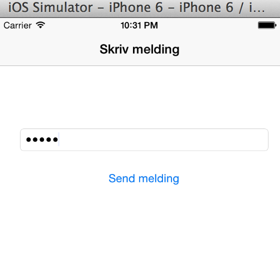
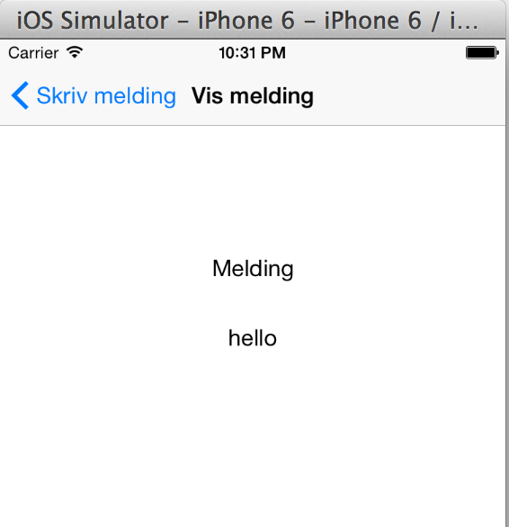
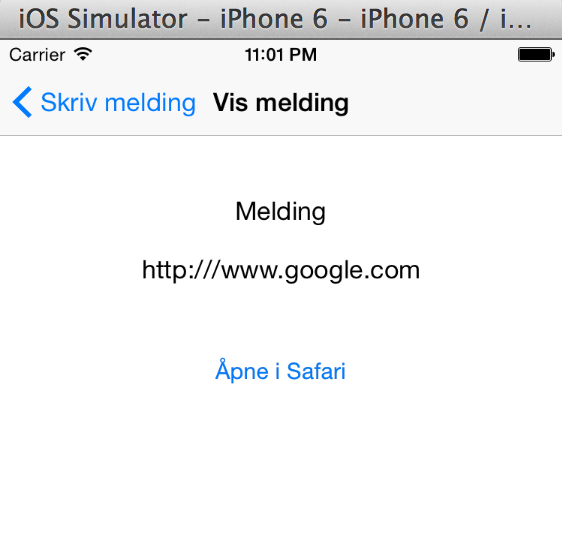
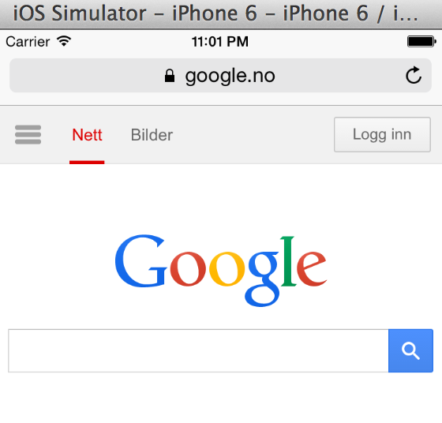
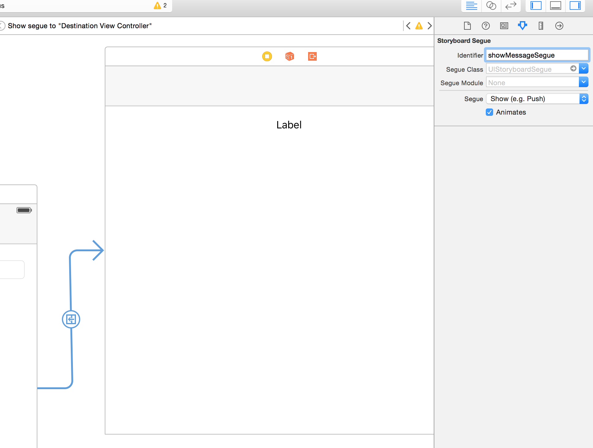

Exercises for assignments Lecture 4
================

Exercise #1
----------------

Recreate the application from the lecture using storyboards and segues, where:

* A message in the first view should be entered (masked, as a password)
* Appears in the second view when you press "Send Message" so that "Placeholder" is replaced with the actual message

Exercise #2
------

Solve Task 1 without using segues (manually create view controller from storyboard)

Exercise #3
----------------

Proceed to Task 2. "Wrap" the existing content view controllers in a Navigation controller. To do this, select the first view controller and Editor -> Embed in -> Navigation controller.

You will get a title bar and back navigation. Enter titles so that the result is:

Exercise #4
----------------

* Expand the app with an "Open in Safari" button on the message screen.
* The button should only be displayed if the message is a valid URL starting with `http://` or `https://`
* Pressing the button will open Safari with this URL

Exercise #5
----------------

Create a third button that goes to `DestinationViewController`, but instead of displaying the text, opens a `UIAlertViewController` with a title similar to the text entered in the text box, and an OK button that closes the alert controller.

Hint: Create a new segue with different identifier and check segue.identifier to know who was used.

