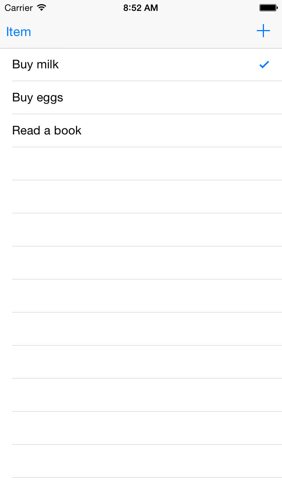
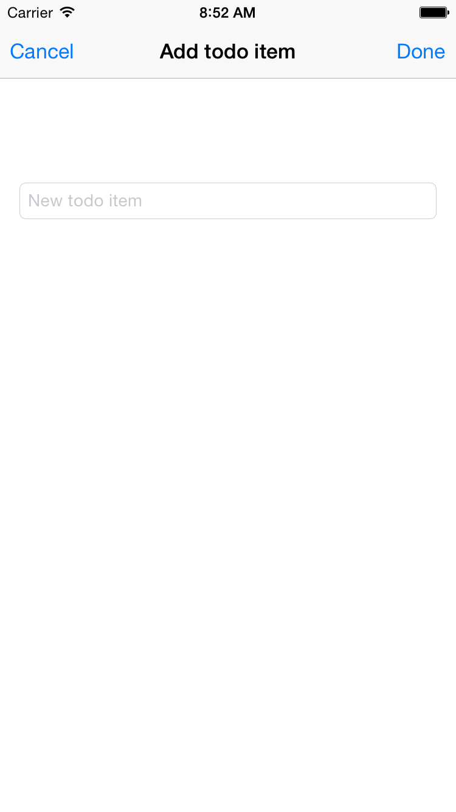
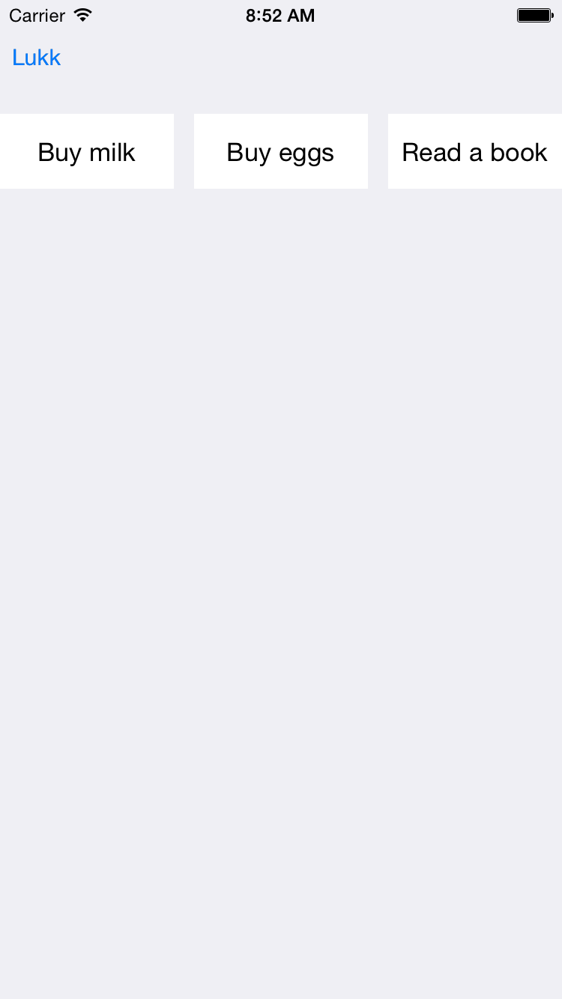

# Exercises Lesson #5

---

## Exercise #1

1. Create a new project, make sure Core data is not checked. You will then create a basic app that can display a list of objects, with the option of add / delete. Find the methods from the UITableViewDataSource protocol and explain what they do.
2. Make the text in the cells be "Number of cells: #", where # is replaced by the number of cells that were before it was added instead of the date they were created.
3. Run the app on both iPhone and iPad simulator, explain what is the difference in UI and why it happens.

## Exercise #2

Create a TODO App that has the following functionality:

1. A user should be presented with a list of tasks when launching the application
2. The user should be able to add a task
3. The user should be able to complete a task and then the task should either be removed from the list or displayed as done
4. The user should be able to delete tasks

HINT: Here you can use UISplitViewController, UINavigationViewController, UITableViewController, UIViewContoller and Delegate pattern

### Eksempel

## Exercise #3

1. Continue on Task 1 and create another view that also shows all tasks, but in a grid
2. Then create a button to toggle between the list you created in Task 1 and the grid

HINT: Use UICollectionViewController

### Eksempel

## Exercise #4

Play with Unified Storyboard, Size classes and Auto Layout to support as many potential sizes in your app.
