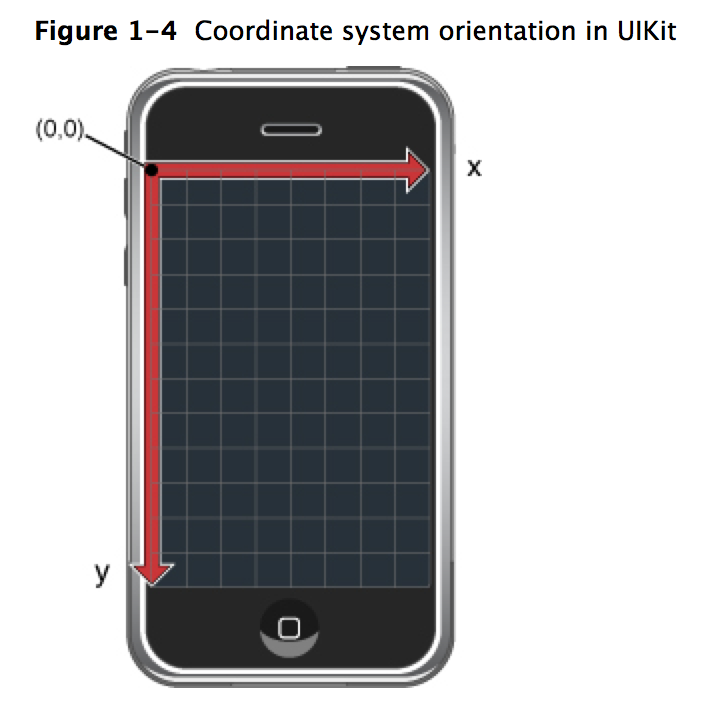
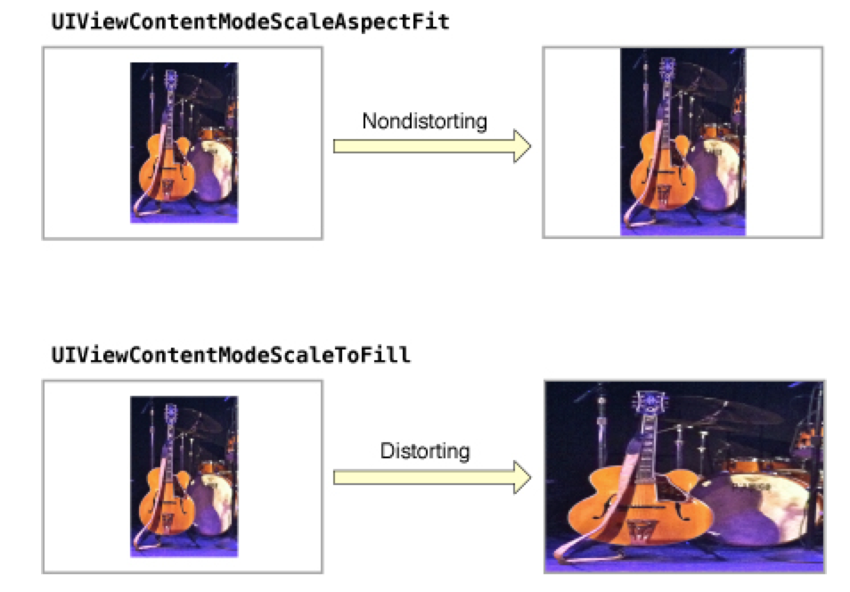
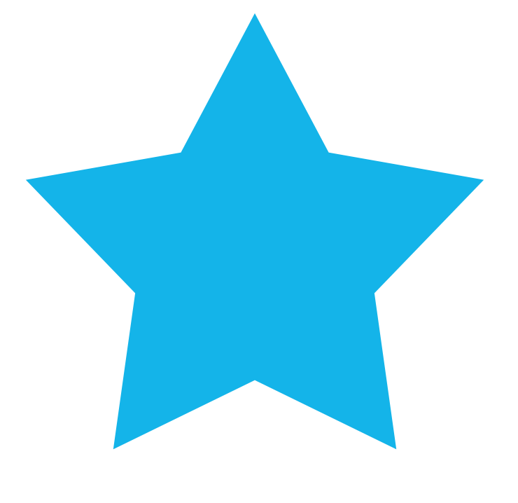
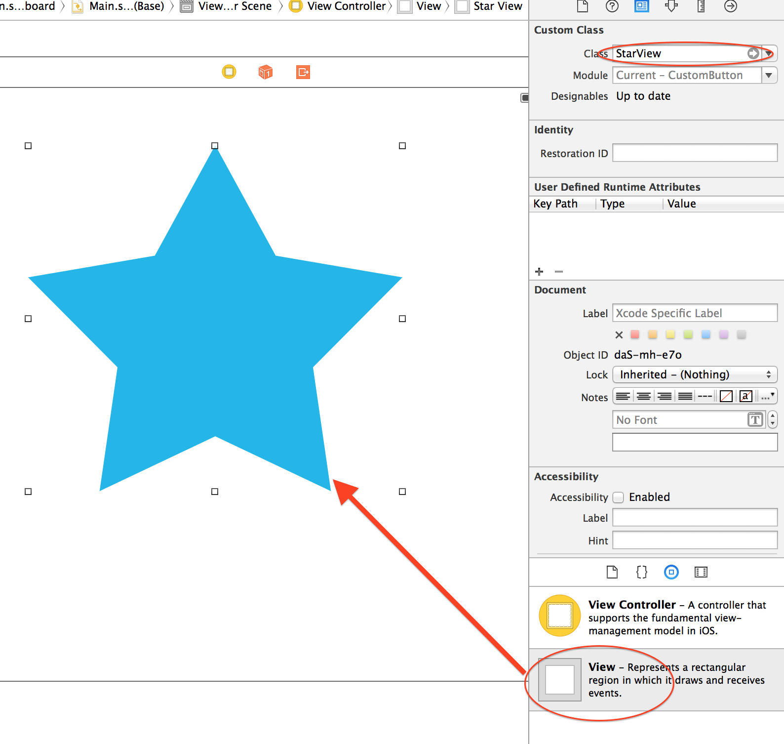
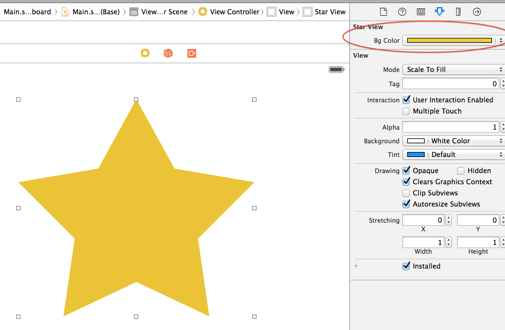
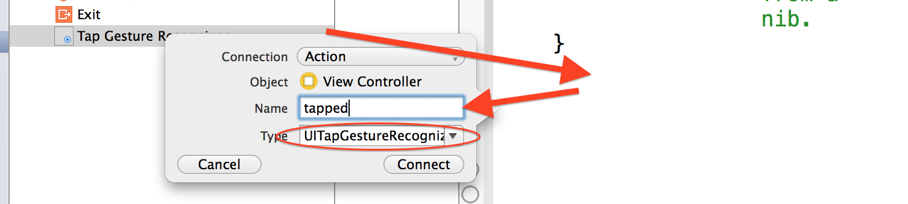

# PG5600
# iOS programmering
## Lesson # 6

---

# Review

* Delegate pattern
* UINavigationController
* UITableView & UITableViewController
* UICollectionView & UICollectionViewController
* Auto Layout
* Unified Storyboard & Size classes

---

# Agenda

* View Concepts
* Instantiating views
* Creating custom views
* Event Handling
* Gestures
* Animations

---

# Views

* Hierarchy with rectangular views
  * subviews and superviews
* Can handle events
  * Typically has the logic of defining what an event means (e.g. tap) and triggering it
  * But does not define the business logic to execute (delegate / call view controller instead)

---

# Coordinate system




---

# Frame vs bounds

* Normally it's bounds when implementing view (inside-out)
  * **bounds**: size and position in own coordinate system
* Normally it's a frame when using a view (outside-in)
  * **frame**: size and position in superview's coordinate system
  * **center**: Center position relative to it's superview
* Updating frame / bounds / center will update values in each other

---

# Content mode

* Determines how a view's content is drawn when a view's bounds change:



---

# Transforms

```swift
func degrees2radians(degrees: Double) -> CGFloat {
    return CGFloat(Double.pi * degrees / 180.0)
}

let rotate = CGAffineTransform(rotationAngle: degrees2radians(degrees: 90))
let scale = CGAffineTransform(scaleX: 2, y: 2)
label.transform = scale.concatenating(rotate)
```

---

# Data Structures


---

# Instantiating views

* From the interface Builder (drag'n'drop)
* From code

---

# From code

```swift
// When the view loads: (evt. viewDidLoad:)
let label = UILabel(frame: CGRect(x: 0, y: 0, width: view.frame.width, height: 20))
label.text = "Hello world"
view.addSubview(label)

// You can also use a XIB:

NSBundle.mainBundle().loadNibNamed("MyView", owner: self, options:nil).first as! UIView


```

---

# Creating custom views

1. Subclass UIView
  * Or UIControl if you create interactive components
2. Override `drawRect:` to draw the view (if needed)
3. Implementing event management (if needed)

---

# The View Drawing Cycle

* Draw code (`drawRect:`) is normally called once and caches
  * Don't call `drawRect:` on your own
* For changes: use `setNeedsDisplay` which will call` drawRect: `on the next cycle


---

# Example



---

```swift
        let bgColor = UIColor(red: 0.078, green: 0.705, blue: 0.912, alpha: 1.000)

        //// Star Drawing
        let starPath = UIBezierPath()
        starPath.move(to: CGPoint(x:frame.minX + 0.50000 * frame.width,y:  frame.minY + 0.00000 * frame.height))
        starPath.addLine(to: CGPoint(x:frame.minX + 0.66095 * frame.width, y: frame.minY + 0.31840 * frame.height))
        starPath.addLine(to: CGPoint(x: frame.minX + 0.99872 * frame.width,y: frame.minY + 0.38093 * frame.height))
        starPath.addLine(to: CGPoint(x: frame.minX + 0.76042 * frame.width,y: frame.minY + 0.64024 * frame.height))
        starPath.addLine(to: CGPoint(x: frame.minX + 0.80823 * frame.width,y: frame.minY + 0.99728 * frame.height))
        starPath.addLine(to: CGPoint(x: frame.minX + 0.50000 * frame.width,y: frame.minY + 0.83915 * frame.height))
        starPath.addLine(to: CGPoint(x: frame.minX + 0.19177 * frame.width, y: frame.minY + 0.99728 * frame.height))
        starPath.addLine(to: CGPoint(x: frame.minX + 0.23958 * frame.width, y: frame.minY + 0.64024 * frame.height))
        starPath.addLine(to: CGPoint(x:frame.minX + 0.00128 * frame.width, y: frame.minY + 0.38093 * frame.height))
        starPath.addLine(to: CGPoint(x:frame.minX + 0.33905 * frame.width,y: frame.minY + 0.31840 * frame.height))
        starPath.close()
        bgColor.setFill()
        starPath.fill()
```

---

# Create custom view out of the drawing

```swift
@IBDesignable // <-- Gives preview in IB
class StarView: UIView {
    override func drawRect(rect: CGRect) {
      // Drawing code here
    }
}
```

---

# Use a custom view in Interface builder



---

# Custom attributes via IB

```swift
@IBDesignable
class StarView: UIView {
  // @IBInspectable becomes available in IB's gui!
  @IBInspectable var bgColor:UIColor = UIColor(red: 0.078, green: 0.705, blue: 0.912, alpha: 1.000)
  //...
}
```
---

# Custom attributes via IB (Cont'd)



---

# Event Handling

Responder chain


---

# Some ways to handle events

* On your own in UIView / UIViewController:
  * `touchesBegan:with:`
  * `touchesMoved:with:`
  * `touchesEnded:with:`
* Create view as subclass of UIControl
* Add gesture recognizers to views

---

# touchesEnded:withEvent:

```swift
@IBDesignable
class StarView: UIView {
  override func drawRect(frame: CGRect) { /* ... */ }

  override func touchesEnded(touches: NSSet, withEvent event: UIEvent) {
    let touch = touches.anyObject() as UITouch
    let point = touch.locationInView(self)

    println("Touch location: \(point)")
  }
}
```

---

# Subclass UIControl

When you create, the Target-Action pattern and logically need a UI control

```swift
class StarView: UIControl {
  //...
}
```

---

# Subclass UIControl (Cont'd)

```swift
// Inherit from UIControl:
func addTarget(target: AnyObject?, action: Selector,
               forControlEvents controlEvents: UIControl.Event) {}
               
// ... and if you want to trigger something custom from your component:
func sendActionsForControlEvents(controlEvents: UIControl.Event) {}

// Which ViewController can listen to with:
starButton.addTarget(self, action: "tappedStar:", for: .touchUpInside)

func tappedStar(sender: AnyObject) {
  println("Tapped!")
}

// ... or drag'n'drop @IBAction as usual
```

---

# Hit testing

Views are rectangular:


Touching the white areas on the star will trigger a tap. This can be solved with custom hit testing.

---

# Hit testing (Cont'd)

```swift
@IBDesignable
class StarView: UIControl {
    var starPath = UIBezierPath()

    override func drawRect(frame: CGRect) {
        //// Star Drawing     
    }

    override func pointInside(point: CGPoint, withEvent event: UIEvent?) -> Bool {
        return starPath.containsPoint(point)
    }
}
```

---

# Gesture recognizers

* Can simplify event management by recognizing common gestures:
  * UITapGestureRecognizer
  * UIPinchGestureRecognizer
  * UIPanGestureRecognizer
  * UISwipeGestureRecognizer
  * UIRotationGestureRecognizer

---

# Gesture recognizers (Cont'd)


---

# Gesture recognizers (Cont'd)

1: Place GR on a (sub) view


---

# Gesture recognizers (Cont'd)

2: Attach action to the view controller



---

# Gesture recognizers (Cont'd)

3: Get info from gesture

```swift
// In the controller. Draw squares where the user tapped
@IBAction func tapped(sender: UITapGestureRecognizer) {
    let point = sender.locationInView(self.view)
    let v = UIView(frame: CGRect(x: 0, y: 0, width: 20, height: 20))

    v.center = point
    v.backgroundColor = .redColor()

    self.view.addSubview(v)
}
```

---

# Animations

* You can make simple animations with UIKit via UIView
* More control via Core Animation (Core Animation Programming Guide)

---

# Animation views with a block

```swift
// self.image.alpha = 1
// Fade-out animation lasting 1st second:
UIView.animate(withDuration: 1) {
    self.image.alpha = 0
}
```

---

# Nested animations

```swift
// Fade out with custom options, then back in
UIView.animate(withDuration: 0.2, delay: 0, options: [.beginFromCurrentState, .curveEaseIn], animations: {
    self.image.alpha = 0
}) { finished in
    UIView.animate(withDuration: 1) {
        self.image.alpha = 1
    }
}
```
---

# Animate entire views

For major changes within the same view:

```swift
UIView.transition(with: self.view, duration: 1, options: .transitionCrossDissolve, animations: {
        // Add / remove / hide / show subviews
}, completion: nil)
```

---

# Animate Constraints

```swift
heightConstraint.constant = 50;    //  @IBoutlet weak var heightConstraint : NSLayoutConstraint!


UIView.animate(withDuration: 2.0) {
     self.view.layoutIfNeeded()
}
```


---

# Animate custom transition between view controllers (with segue)

1. Create a new class that inherits from `UIStoryboardSegue`
2. Make segue as usual between VC in storyboard, but select "Custom" as type
3. Set segue class:


---
```swift
class CustomSegue: UIStoryboardSegue {
  override func perform() {
    let source = self.source as UIViewController
    let destination = self.destination as UIViewController

    // 1. Insert the destination view into the source view
    source.view.addSubview(destination.view)

    // 2. set views state for views

    UIView.animate(withDuration: 1, animations: {
        // 3. set up the final state for views
        }) { finished in
        // 4. present the destination controller when the animation is complete
    }
  }
}
```

---

```swift
class CustomSegue: UIStoryboardSegue {
  override func perform() {
    let source = self.source as UIViewController
    let destination = self.destination as UIViewController

    source.view.addSubview(destination.view)

    destination.view.alpha = 0
    destination.view.transform = CGAffineTransform(scaleX: 0.05, y: 0.05)

    UIView.animate(withDuration: 1, animations: { () -> Void in
        destination.view.alpha = 1
        destination.view.transform = CGAffineTransform(scaleX: 1, y: 1)
        }) { finished in
        //source.presentViewController(destination, animated: false, completion: nil)
        source.navigationController?.pushViewController(destination, animated: false)
    }
  }
}

```


---

# Further reading

- Constraint animation how-to: http://stackoverflow.com/questions/12622424/how-do-i-animate-constraint-changes
- Last part of lecture 5 in developing iOS 8 Apps with Swift from Stanford
- 6.6 in the iOS programming cookbook for XIB with CollectionView / TableView
- The basic in iOS programming cookbook for more on UIView
- UIKit Catalog (iOS): Creating and Customizing UIKit Controls -  Example project
