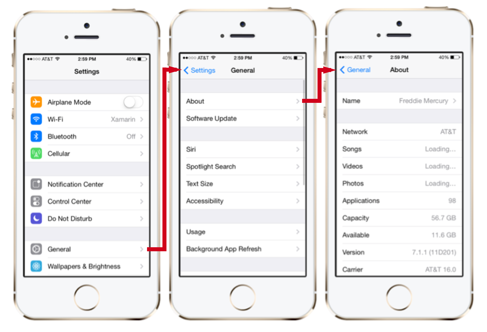

# PG5600
# iOS programmering
## Forelesning 5

---

# Sist gang

* Sette opp et nytt iOS prosjekt i XCode
* Komponentene i en iOS app
* Launch flow
* Application lifecycle
* MVC
* View og view controllers

---

# Agenda

* Delegate pattern
* UINavigationController
* UITableView og UITableViewController
* UICollectionView og UICollectionViewController
* Auto Layout
* Unified Storyboard og Size classes

---

# Delegate pattern

---

* Design pattern for å få et objekt til å delegere deler av sine oppgaver til et annet objekt
* Det delegerne objektet holder på en referanse til et annet objekt kalt delegatet
* Det delegerende objektet kaller en eller flere metoder på delegatet
* Delegate patterne er mye brukt i Cocoa Touch

---


---


---
# Hva trengs?

---
# En protocol

---

```swift


protocol DataHandlerProtocol {
    func didFinishGetting(data: NSData)
    func didFailGettingData(error: NSError)
}
```

---

# Et delegat som implementerer protocolen

---

```swift


class A : DataHandlerProtocol {
    func didFinishGetting(data: NSData) {
        print(data)
    }

    func didFailGettingData(error: NSError) {
        print(error)
    }
}
```

---

# Et delegerende objekt

---

```swift


class Fetcher {

    var delegate: DataHandlerProtocol?

    func fetch() {
        delegate?.didFinishGetting(NSData())
    }

}
```

---

# Delegate-pattern Brukes blant annet av:
- UITableView
- UICollectionView
- UINavigationController

---

# UINavigationController


* En av standard komponentene
* Holder på en samling av UIViewController's
  * _En UIViewController holder på en samling av views_
* En UINavigationController kordinerer navigasjonen mellom UIViewController
* I tillegg til navigasjon har den også ansvar for en UINavigationBar og en UIToolbar

---


---

UIViewController er håndtert av UINavigationController ved å:

* Pushe og poppe UIViewController på UINavigationController view stacken
* Når et view blir pushet, så blir nåvœrende view dyttet ut av skjermen til venstre og det nye kommer inn fra høyre
* Om du bruker storyboard så blir alt dette automatisk håndtert
* Hvis du bruker XIB filer eller bare kode så må du selv pushe og poppe

---




---

# Kan jeg gjore det i kode?

```swift


    let rootViewController = UIViewController()
    var aNavigationController = UINavigationController(rootViewController: rootViewController)
    presentViewController(aNavigationController animated:true, completion: nil)


```

---

# Push og pop

```swift

var viewController = UIViewController()
navController.pushViewController(viewController, animated: true)
navController.popViewControllerAnimated(true)
```

---

# UIButton og UINavigationBar

```swift
class ViewController: UIViewController {

    override func viewDidLoad() {
        super.viewDidLoad()

        var rightButton = UIBarButtonItem(
          barButtonSystemItem: UIBarButtonSystemItem.Add,
          target: self,
          action: Selector("buttonTouched:"))

        self.navigationItem.rightBarButtonItem = rightButton;
    }

    func buttonTouched(sender: AnyObject) {
        self.navigationController?.pushViewController(ViewController(), animated: true)
    }

    override func didReceiveMemoryWarning() {
        super.didReceiveMemoryWarning()
    }
}
```

---

# UILabel/Tittel og UINavigationBar

```swift
class ViewController: UIViewController {

    override func viewDidLoad() {
        super.viewDidLoad()


        self.navigationItem.title = "Test tittel"


    }
}
```

---

#  UITableView
# _&_
# UITableViewController

---

# Noen bruksområder

* Navigere hierarkisk data
* Presentere en liste av elementer
* Vise detaljinformasjon og kontroller i visuelle grupperinger
* Vise valgbare alternativer

---

### Spotify


---

### Peek


---

### Airbnb


---

# Egenskaper og innhold

* Hver rad består av en UITableViewCell
* Kommer med noen pre-definerte design (kan lage egne)
* Kan respondere på at man klikker på en celle
* Har implementert editeringsmuligheter:
 * Legg til
 * Fjern
 * Omorganisering

---


---

# Demo
### Nytt prosjekt -> Master/detail-application

---

# Men hvordan sette data før man navigerer? Fra sist!
destinationViewController as? ReceivingViewController {
            vc.message = message.text
        }

    }
}
```

---

# UICollectionView

---

* Er et friere alternativ til UITableView
* Endringer gjøres ved hjelp av subclassing
* Du kan implementere grids-, stacks-, sirkulœre layout
* eller hva som helst annet du kan se for deg

---


---


---

# UICollectionViewController består av:

---

# UICollectionView
###Hoved  viewet som inneholder alle de andre viewene. Dette er veldig likt UITableView

---

# UICollectionViewCell
### Lik UITableViewCell i UITableView. Celler kan lages programatisk eller via interface builder

---

# Supplementary Views
### Du kan legge til flere views som ikke er celler
### Dette er typisk view i toppen og bunnen

---

# Decoration View
### views som ikke legger til noe funksjonalitet, men har til hensikt å gjøre collection view visuelt penere

---

#  UICollectionViewLayout
### Bestemmer hvordan layout av cellene skal vœre
### Layout kan byttes ut runtime

---

#  UICollectionViewFlowLayout
### Apple har laget et eget layout som følger med

---


---

#  Auto Layout

---

* Legger ut ditt brukergrensesnitt basert på et sett med regler
* Du definerer opp reglene ved hjelp av Auto Layout
* Målet er å lage dynamisk grensesnitt som responderer på endringer i størrelse, orientering og lokalisering (språk)
* Auto Layout er bygd inn i Interface Builder

---

* __Kontant verdi__ - Den fysiske størrelsen eller offsettet in antall punkt for regelen
* __Relasjon__ - Bruk relasjoner og større enn, mindre enn eller lik for å spesifisere for eksempel at et views bredde >= 20, eller at et textview.leading >= (superview.leading + 20).
* __Prioritetsgrad__ - Regler kan ha prioritet, slik at noen kan telle mindre enn andre. Default er prioriteten satt til maks (påkrevd) og da vil den bli håndhevd

---

# Interface builder, point and click

<br />
<br />


---

# Programatisk

* Visual Format Language

```swift


let views = ["button1": UIButton(), "button2": UIButton()]
var constraints = NSLayoutConstraint.constraintsWithVisualFormat(
  "[button1]-[button2]",
  options: NSLayoutFormatOptions.AlignAllBaseline,
  metrics: nil,
  views: views
)
```

---

Ikke alt kan lages ved hjelp av visual format, for eksempel:

```swift
imageView.width = 2 * imageView.height
```

```swift
// Vil gjøre det samme som eksempelet med visual format
NSLayoutConstraint(
  item: self.button1,
  attribute: NSLayoutAttribute.Right,
  relatedBy: NSLayoutRelation.Equal,
  toItem: self.button2,
  attribute: NSLayoutAttribute.Left,
  multiplier: 1.0,
  constant: -12.0
)
```

---
# Finnes også alternativer

- https://github.com/robb/Cartography
- https://github.com/PureLayout/PureLayout
- https://github.com/SnapKit/Masonry

Anbefaler å gjøre mest i storyboard


(ikke pensum)


---

#  Aktivere og deaktivere på NSLayoutConstraint

```swift

    var active: Bool

    class func activateConstraints(constraints: [AnyObject])

    class func deactivateConstraints(constraints: [AnyObject])

```

---

# Potensielle problemer

* Manglende regler
* Viewet i inferface builder er plassert et annet sted en reglene vil plassere det
* Konflikter
* Tvetydighet - når det er flere løsninger for et view basert på reglene
* Manglende regler

---

#  Demo
#  Constraint og Interface Builder
CTRL dra og pek

---

# View debugging, trykk pause

---

#  Unified Storyboard
#                                &
#  Size classes

---

#### Hva er det til?

# For å gjøre det enklere å støtte flere skjermstørrelser

---

#### Hvorfor?

## Apps bør tilpasse seg endring i orientering og skjermstørrelse for å gi en bedre brukeropplevelse

---

# Size classes

* Regular - Representerer mye skjermplass
* Compact - Representerer lite skjermplass

---


###### _http://developer.xamarin.com/guides/ios/platform_features/intro_to_unified_Storyboards/_

---


---


---

# iPhone 6+


---

# Traits

* Et system for å håndtere size classes
* Består av et sett med properties som kan brukes for å definere opp hvordan ditt layout skal endre seg ettersom miljøet endrer seg

```swift
class UITraitCollection : NSObject, NSCopying, NSSecureCoding, NSCoding {
    ...

    var userInterfaceIdiom: UIUserInterfaceIdiom { get }
    var displayScale: CGFloat { get }
    var horizontalSizeClass: UIUserInterfaceSizeClass { get }
    var verticalSizeClass: UIUserInterfaceSizeClass { get }
    ...
}
```

---

# Tilgjengelig på følgende objekter igjennom UITraitEnvironment

* Screens ( UIScreens ).
* Windows ( UIWindows ).
* View Controllers ( UIViewController )
* Views ( UIView )
* Presentation Controller ( UIPresentationController )

* Man arver traits nedover i arvetreet

---


###### _http://developer.xamarin.com/guides/ios/platform_features/intro_to_unified_Storyboards/_


---

```swift


func traitCollectionDidChange(previousTraitCollection: UITraitCollection)
```


---

# Videre lesning

- Kapittel 6 i iOS 8 Swift Programming Cookbook
- View Controller programming guide - Apple docs
     - The adaptive model

---

#Kontrollspørsmål

- Forklar delegates og nevn noen eksempler på kjente iOS-komponenter som bruker det
- Hva er forskjellen på TableView og CollectionView?
- Hvordan kan man sette tittel og knapper øverst i UINavigationBar?
- Hvordan kan man gjøre så layout i en app er tilpasset flere skjermer?
