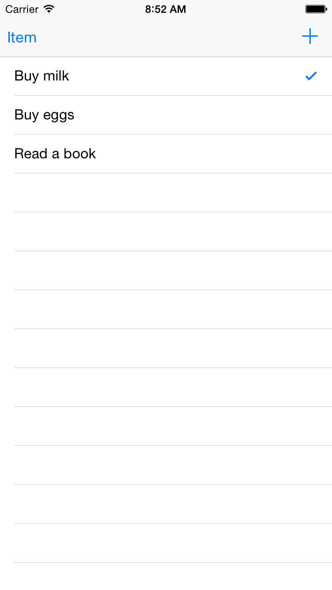
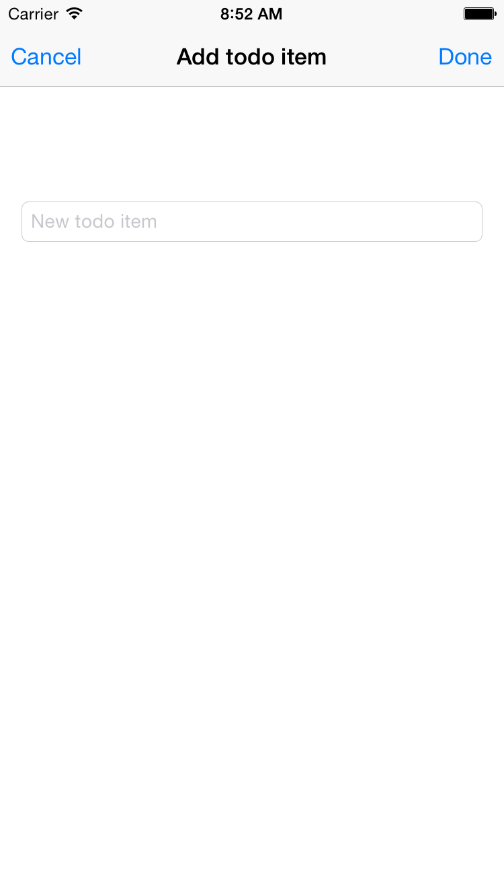
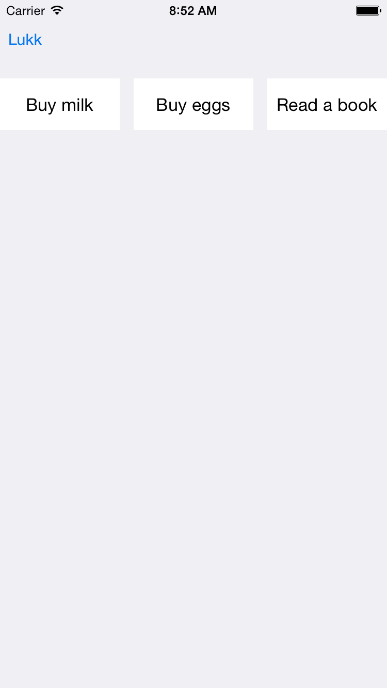

# Øvingsoppgaver forelesning 5

---

## Oppgave 1

1. Lag et nytt prosjekt med Master/detail-application, pass på at Core data ikke er huket av. Du vil da få laget en basic app som kan vise en liste av objekter, med mulighet for add/delete. Finn metodene fra protocollen UITableViewDataSource, og forklar hva disse gjør.
2. Få teksten i cellene til å være "Antall celler: #", hvor # byttes ut med antall celler som var før den ble lagt til istedetfor datoen de ble laget på.
3. Kjør appen på både iPhone og iPad - simulator, forklar hva som er forskjellen i UIet, og hvorfor det skjer.

## Oppgave 2

Implementer en TODO App som har følgende funksjonalitet:

1. En bruker skal bli presentert med en liste av oppgaver når han starter applikasjonen
2. Brukeren skal ha mulighet for å legge til en oppgave
3. Brukeren skal kunne fullføre en oppgave og da skal oppgaven enten bli borte fra listen eller vises som ferdig
4. Brukeren skal kunne slette oppgaver

HINT: Her kan man bruke UISplitViewController, UINavigationViewController, UITableViewController, UIViewContoller og Delegate pattern

Vanskelig vri: Lag appen som single view application, og gjør alt oppsettet selv.

### Eksempel

# Oppgave 2

1. Fortsett på oppgave 1 og lag et annet view som også viser alle oppgaver, men i en grid
2. Lag deretter en knapp for å toggle mellom listen som du lagde i oppgave 1 og grid'et

HINT: Ta i bruk UICollectionViewController

### Eksempel

## Oppgave 3

Lek med Unified Storyboard, Size classes og Auto Layout for å støtte flest mulig potensielle størrelser i appen din.

HINT: Dette kan for eksempel vœre iPhone versjon <= 5, iPhone versjon >= 6 og iPad
