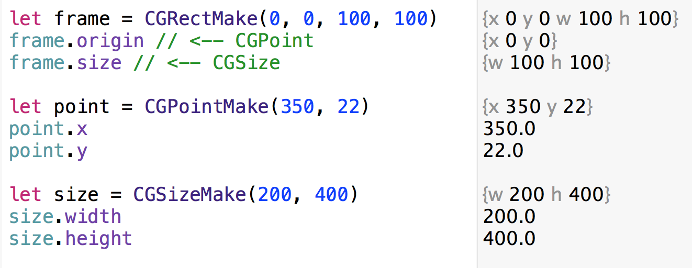
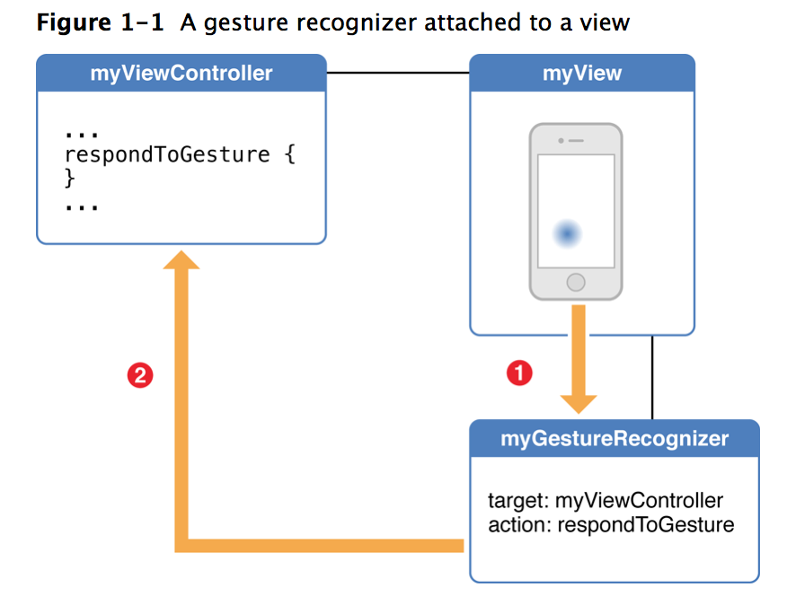

# PG5600
# iOS programmering
## Forelesning 6

---

# Sist gang

* Delegate pattern
* UINavigationController
* UITableView og UITableViewController
* UICollectionsView og UICollectionViewController
* Auto Layout
* Unified Storyboard og Size classes

---

# Agenda

* Viewkonsepter
* Å instansiere views
* Å lage custom views
* Eventhåndtering
* Gestures
* Animasjoner

---

# Views

* Hiarki med rektangulære views
  * subviews og superviews
* Kan håndterer events
  * Har typisk logikken hvor å definere hva et event betyr (eks. tap) og trigge dette
  * Men definerer ikke forretningslogikken som skal utføres (delegerer/kaller view controller i stedet)

---

# Koordinatsystem


---

# Frame vs. bounds

* Normalt bounds ved implementering av view (inside-out)
  * **bounds**: størrelse i eget koordinatsystem
* Normalt frame ved bruk av et view (outside-in)
  * **frame**: størrelse og posisjon i superview
  * **center**: senterposisjon ift. superview
* Oppdatering av frame/bounds/center vil oppdatere verdier i hverandre

---

# Content mode

* Bestemmer hvordan et view sitt innhold tegnes når et view sine bounds forandres:


---

# Transforms

```swift
func degrees2radians(degrees: Double) -> CGFloat {
    return CGFloat(M_PI * degrees / 180.0)
}

let rotate = CGAffineTransformMakeRotation(degrees2radians(90))
let scale = CGAffineTransformMakeScale(2, 2)
label.transform = CGAffineTransformConcat(scale, rotate)
```

---

# Datastrukturer



---

# Å instansiere views

---

# Å instansiere views

* Fra Interface Builder (drag'n'drop)
* Fra kode

---

# Fra kode

```swift
// I loadView: (evt. viewDidLoad:)
let label = UILabel(frame: CGRectMake(0, 0, view.frame.width, 20))
label.text = "Hello world"
label.textAlignment = NSTextAlignment.Center
view.addSubview(label)

// Bruk XIB:

NSBundle.mainBundle().loadNibNamed("MyView", owner: self, options:nil).first as! UIView


```

---

# Å lage custom views

---

# Å lage custom views

1. Subclass UIView
  * Eller UIControl om du lager interaktive komponenter
2. Override `drawRect:` for å tegne viewet (ved behov)
3. Implementerer eventhåndtering (ved behov)

---

# The View Drawing Cycle

* Draw-kode (`drawRect:`) kalles normalt en gang og caches
  * Ikke kall `drawRect:` på egenhånd
* Ved endringer: bruk `setNeedsDisplay` som vil kalle `drawRect:` ved neste anledning


---

# Eksempel


---

```swift
//// Color Declarations
let bgColor = UIColor(red: 0.078, green: 0.705, blue: 0.912, alpha: 1.000)

//// Star Drawing
var starPath = UIBezierPath()
starPath.moveToPoint(CGPointMake(frame.minX + 0.50000 * frame.width, frame.minY + 0.00000 * frame.height))
starPath.addLineToPoint(CGPointMake(frame.minX + 0.66095 * frame.width, frame.minY + 0.31840 * frame.height))
starPath.addLineToPoint(CGPointMake(frame.minX + 0.99872 * frame.width, frame.minY + 0.38093 * frame.height))
starPath.addLineToPoint(CGPointMake(frame.minX + 0.76042 * frame.width, frame.minY + 0.64024 * frame.height))
starPath.addLineToPoint(CGPointMake(frame.minX + 0.80823 * frame.width, frame.minY + 0.99728 * frame.height))
starPath.addLineToPoint(CGPointMake(frame.minX + 0.50000 * frame.width, frame.minY + 0.83915 * frame.height))
starPath.addLineToPoint(CGPointMake(frame.minX + 0.19177 * frame.width, frame.minY + 0.99728 * frame.height))
starPath.addLineToPoint(CGPointMake(frame.minX + 0.23958 * frame.width, frame.minY + 0.64024 * frame.height))
starPath.addLineToPoint(CGPointMake(frame.minX + 0.00128 * frame.width, frame.minY + 0.38093 * frame.height))
starPath.addLineToPoint(CGPointMake(frame.minX + 0.33905 * frame.width, frame.minY + 0.31840 * frame.height))
starPath.closePath()
bgColor.setFill()
starPath.fill()
```

---

# Lag custom view ut av tegningen

```swift
@IBDesignable // <-- Gir preview i IB
class StarView: UIView {

    override func drawRect(rect: CGRect)
    {
      // tegnekode her
    }
}
```

---

# Bruk custom view i Interface builder


---

# Custom attributter via IB

```swift
@IBDesignable
class StarView: UIView {

  // @IBInspectable blir tilgjengelig i IB sitt gui!
  @IBInspectable var bgColor:UIColor = UIColor(red: 0.078, green: 0.705,
      blue: 0.912, alpha: 1.000)
  //...

}
```
---

# Custom attributter via IB


---

# Eventhåndtering

---

# Responder chain


---

# Noen måter å håndtere eventer

* På egenhånd i UIView / UIViewController:
  * `touchesBegan:withEvent:`
  * `touchesMoved:withEvent:`
  * `touchesEnded:withEvent:`
* Lage view som subklasser UIControl
* Legge gesture recognizers på views

---

# touchesEnded:withEvent:

```swift
@IBDesignable
class StarView: UIView {

  override func drawRect(frame: CGRect) { /* ... */ }

  override func touchesEnded(touches: NSSet, withEvent event: UIEvent) {
    let touch = touches.anyObject() as UITouch
    let point = touch.locationInView(self)
    println("Touch location: \(point)")
  }
}
```

---

# Subclass UIControl

Når det du lager trenger Target-Action patternet og logisk sett er en UI-kontroll

```swift
class StarView: UIControl {
  //...
}
```

---

# Subclass UIControl

```swift
// Arver fra UIControl:
func addTarget(target: AnyObject?, action: Selector,
  forControlEvents controlEvents: UIControlEvents)
// ... og hvis du vil trigge noe custom fra komponenten din:
func sendActionsForControlEvents(controlEvents: UIControlEvents)

// Som ViewController kan lytte på med:
starButton.addTarget(self, action: "tappedStar:", forControlEvents: .TouchUpInside)

func tappedStar(sender: AnyObject) {
  println("Tapped!")
}

// ... eller drag'n'drop @IBAction som vanlig
```

---

# Hit testing

View er rektangulære:


Trykke på de hvite områdene på stjerna trigger tap. Kan løses med custom hit testing.

---

# Hit testing

```swift
@IBDesignable
class StarView: UIControl {

    var starPath = UIBezierPath()

    override func drawRect(frame: CGRect)
    {
        //// Star Drawing     
    }

    override func pointInside(point: CGPoint, withEvent event: UIEvent?) -> Bool {
        return starPath.containsPoint(point)
    }
}
```

---

# Gesture recognizers

---

# Gesture recognizers

* Kan forenkler eventhåndtering ved å gjenkjenne vanlige gestures:
  * UITapGestureRecognizer
  * UIPinchGestureRecognizer
  * UIPanGestureRecognizer
  * UISwipeGestureRecognizer
  * UIRotationGestureRecognizer

---

# Gesture recognizers



---

# 1. Legg GR på et (sub)view


---

# 2. Knytt action til viewcontroller


---

# 3. Hent ut info fra gesture

```swift
// I controller. Tegn firkanter der brukeren tappet
@IBAction func tapped(sender: UITapGestureRecognizer) {
    let point = sender.locationInView(self.view)
    let v = UIView(frame: CGRectMake(0, 0, 20, 20))
    v.center = point
    v.backgroundColor = .redColor()
    self.view.addSubview(v)
}
```

---

# Animasjoner

---

# Animasjoner

* Enklere animasjoner med UIKit via UIView
* Mer kontroll via Core Animation (Core Animation Programming Guide)

---

# Viewanimasjon med blokk

```swift
// self.image.alpha = 1
// Vil bli en fade-out animasjon på 1. sekund:
UIView.animateWithDuration(1, animations: { () -> Void in
    self.image.alpha = 0
})
```

---

# Nøstede animasjoner

```swift
// Fade ut med custom options, deretter inn igjen
UIView.animateWithDuration(0.2, delay: 0, options:
  UIViewAnimationOptions.BeginFromCurrentState | UIViewAnimationOptions.CurveEaseIn,
animations: { () -> Void in
    self.image.alpha = 0
}) { (finished) -> Void in
    UIView.animateWithDuration(1, animations: { () -> Void in
        self.image.alpha = 1
    })
}
```
---

# Animer hele views

Ved større endringer innenfor samme view:

```swift
UIView.transitionWithView(self.view, duration: 1, options:
  UIViewAnimationOptions.TransitionCrossDissolve, animations: { () -> Void in
  // Legg til/fjern/skul/vis subviews
}, completion: nil)
```

---

#Animer Constraints

```swift
heightConstraint.constant = 50;    //  @IBoutlet weak var heightConstraint : NSLayoutConstraint!


UIView.animateWithDuration(2.0) {
     self.view.layoutIfNeeded()
}

```


---

# Animer custom overgang mellom view controllere (med segue)

1. Opprett en ny klasse som arver fra `UIStoryboardSegue`
2. Lag segue som vanlig mellom VC i storyboard, men velg "Custom" som type
3. Sett segue class:


---

```swift
class CustomSegue: UIStoryboardSegue {
  override func perform() {
    let source = self.sourceViewController as UIViewController
    let destination = self.destinationViewController as UIViewController

    // 1. Legg destination viewet inn i source viewet
    source.view.addSubview(destination.view)

    // 2. <sett opp starttilstand for views>

    UIView.animateWithDuration(1, animations: { () -> Void in
        // 3. <sett opp sluttilstand for views>
        }) { (finished) -> Void in
        // 4. <presenter destinationcontroller når animasjonen er ferdig>
    }
  }
}
```

---

```swift
class CustomSegue: UIStoryboardSegue {
  override func perform() {
    let source = self.sourceViewController as UIViewController
    let destination = self.destinationViewController as UIViewController

    source.view.addSubview(destination.view)

    destination.view.alpha = 0
    destination.view.transform = CGAffineTransformMakeScale(0.05, 0.05)

    UIView.animateWithDuration(1, animations: { () -> Void in
        destination.view.alpha = 1
        destination.view.transform = CGAffineTransformMakeScale(1, 1)
        }) { (finished) -> Void in
        //source.presentViewController(destination, animated: false, completion: nil)
        source.navigationController!.pushViewController(destination, animated: false)
    }
  }
}

```


---
# videre lesning

- Constraint animation howto: http://stackoverflow.com/questions/12622424/how-do-i-animate-constraint-changes
- Siste del av forelesning 5 i developing iOS 8 Apps with Swift fra Stanford
- 6.6 i iOS programming coookbok for XIB med CollectionView/TableView
- The basic i iOS programming coookbok for mer om UIView
- UIKit Catalog (iOS): Creating and Customizing UIKit Controls - Example-prosjekt


---

# Oppgaver

## Se oppgaver på IT's learning
