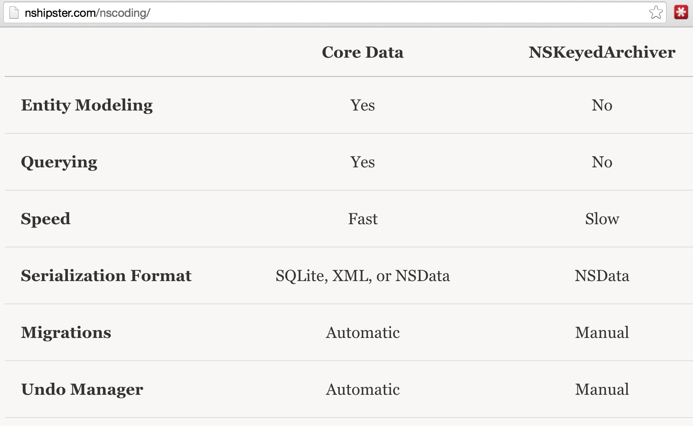
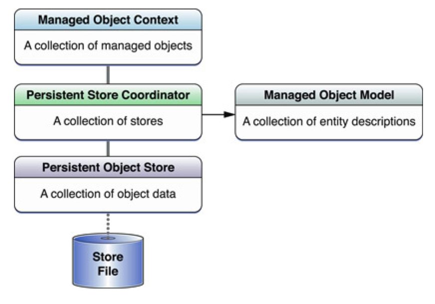
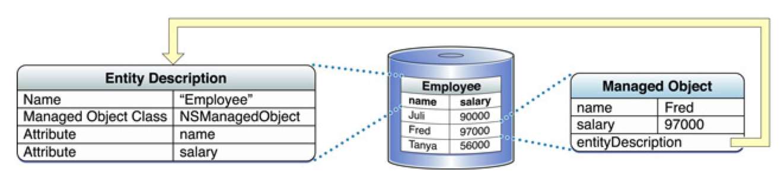
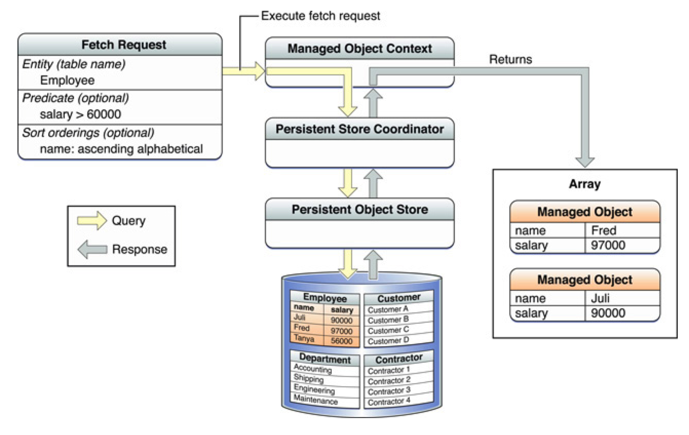

# PG5600
# iOS programmering
## Forelesning 8 - Persistering

---

# Sist gang

* Debugging
* Testing
* Swift og gjenbruk av kode
  * Rammeverk
  * Cocoapods & Carthage
* Tråder og asynkronitet
* Snakke med internett
* try & json

---

# Agenda

* Hvor filer lagres
* Enkel lesing og skriving til disk
* UserDefaults
* NSKeyedArchiver / NSKeyedUnarchiver
* Core Data
* Keychain

---

# Hvor filer lagres

```swift
let fm = FileManager.default

// <app home>/Documents, backes opp, kan bli vist til bruker
// For brukerens datafiler

fm.urls(for: .documentDirectory, in: .userDomainMask)

// <app home>/Library, backes opp, skjult
// For det som ikke er brukerens datafiler
fm.urls(fol: .libraryDirectory, in: .userDomainMask)

// <app home>/Library/Caches, backes IKKE opp, skjult
// F.eks. for caching av bilder
fm.urls(fol: .cachesDirectory, in: .userDomainMask)

// <app home>/tmp, backes IKKE opp
// For midlertidige filer som ikke trenger å eksistere mellom launches
print(NSTemporaryDirectory())
```

---

# Skriv og les string til disk

```swift

       let dir = FileManager.default.urls(for: .documentDirectory,
                                          in: .userDomainMask)[0]

       let string: NSString = "Hello world"

       let path = dir.appendingPathComponent("file.txt").path

       try! string.write(toFile: path, atomically: true, encoding: String.Encoding.utf8.rawValue)

```

---

# Skriv og les NSDictionary til plist

```swift
let dir = FileManager.default.urls(for: .documentDirectory,
                                   in: .userDomainMask)[0]
let dict = ["workouts": 23] as NSDictionary

let path = dir.appendingPathComponent("file.txt").path

// Skriv
dict.writeToFile(path, atomically: true)

// Les
print(NSDictionary(contentsOfFile: path))
```

---

# NSUserDefaults

---

# NSUserDefaults

* For enkle verdier og caser
* Eksempel: lagre brukerens preferanser
* Verdier caches slik at man slipper diskaksess ved hver henting
* Synkronisering av verdier mot disk skjer automatisk ved jevne mellomrom

---

```swift
let userDefaults = UserDefaults.standard
userDefaults.setObject("Tim Cook", forKey: "name")

if let name = userDefaults.stringForKey("name") {
    print("Got Name: \(name)")
}

// boolForKey, intForKey .. osv

// Tving synkronisering mot disk
userDefaults.synchronize()
```

---

# NSKeyedArchiver / NSKeyedUnarchiver

---

# NSKeyedArchiver / NSKeyedUnarchiver

* For serialisering av objekter til disk
* Klasser som skal serialiseres må implementere Coding-protokollen. Mange standard datatyper gjør dette allerede.
* [Pass på fremover og bakoverkompatibilitet](https://developer.apple.com/library/mac/documentation/cocoa/conceptual/Archiving/Articles/compatibility.html)

---

# Klasse som implementerer Coding

```swift

class Workout : NSObject, Coding {
    var name: String!
    var entries: Int = 0

    required convenience init(coder aDecoder: NSCoder) {
        self.init()
        name = aDecoder.decodeObjectForKey("name") as! String
        entries = aDecoder.decodeIntegerForKey("entries")
    }

    func encodeWithCoder(aCoder: NSCoder) {
        aCoder.encodeObject(self.name, forKey: "name")
        aCoder.encodeInteger(self.entries, forKey: "entries")
    }
}
```

---

# Eksempel serialisering og deserialisering

```swift

let libDir = FileManager.default.urls(for: .libraryDirectory,
                                   in: .userDomainMask)[0]
print(libDir)

let workout = Workout()
workout.entries = 14
workout.name = "Pull-ups"

let path = libDir.URLByAppendingPathComponent("workouts").path!

// Serialisere til disk
NSKeyedArchiver.archiveRootObject(workout, toFile: path)

// Deserialisere fra disk
let savedWorkout = NSKeyedUnarchiver.unarchiveObjectWithFile(path) as! Workout
print("\(savedWorkout.name), entries: \(savedWorkout.entries)")
```

---

# Core Data

---

# Core Data

For mer komplekse behov, når du trenger:

* Å lagre objektgrafer (med relasjoner)
* Å gjøre spørringer mot objektgrafer
* Støtte undo/redo
* Lagre objektgrafer i iCloud

---




---

# Terminologi

les her:
https://developer.apple.com/library/archive/documentation/DataManagement/Devpedia-CoreData/coreDataStack.html#//apple_ref/doc/uid/TP40010398-CH25-SW1




---

# Inngangspunktet til Core Data

```
lazy var persistentContainer: NSPersistentContainer = {
    /*
     The persistent container for the application. This implementation
     creates and returns a container, having loaded the store for the
     application to it. This property is optional since there are legitimate
     error conditions that could cause the creation of the store to fail.
    */
    let container = NSPersistentContainer(name: "CoreDataTest")
    container.loadPersistentStores(completionHandler: { (storeDescription, error) in
        if let error = error as NSError? {
            // Replace this implementation with code to handle the error appropriately.
            // fatalError() causes the application to generate a crash log and terminate. You should not use this function in a shipping application, although it may be useful during development.

            /*
             Typical reasons for an error here include:
             * The parent directory does not exist, cannot be created, or disallows writing.
             * The persistent store is not accessible, due to permissions or data protection when the device is locked.
             * The device is out of space.
             * The store could not be migrated to the current model version.
             Check the error message to determine what the actual problem was.
             */
            fatalError("Unresolved error \(error), \(error.userInfo)")
        }
    })
    return container
}()

```

---

# DEMO

### single view application - Check Core Data

---

# Managed Objects



I utgangspunktet NSManagedObject's med key/value. Disse **kan** og **bør** ofte ha en subklasse for renere kode og mer funksjonalitet, men må ikke

---

# Fetch Requests



---

# Opprett

```swift
let entity = NSEntityDescription.entityForName("Workout",
				inManagedObjectContext: moc)

var workout = Workout(entity: entity!,
				insertIntoManagedObjectContext: moc)
workout.name = excersice
workout.entries = 0


try! moc.save()

workouts.append(workout)
```

---
# Opprett med convenience init


```swift

// nilable initializer!
 convenience init?(attributes: [String : String], managedObjectContext: NSManagedObjectContext) {

        self.init(entity: NSEntityDescription.entityForName("Workout", inManagedObjectContext: managedObjectContext)!, insertIntoManagedObjectContext: managedObjectContext)


     	if let actualName = attributes["name"] as? String {
        	self.name = actualName
        } else {
            return nil
        }

        if let actualDifficulty = attributes["difficulty"] as? Int {
         	self.difficulty = actualDifficulty
        } else {
         	return nil
        }

    }

 ```
---

# Hent alle

```swift

let query = NSFetchRequest<Workout>(entityName: "Workout")

let results = try! moc.fetch(query)
workouts = results
    //  tableView.reloadData()

```

---

# Fetch med predicate (spørring)

```swift
var query = NSFetchRequest<Workout>(entityName: "Workout")
query.predicate = NSPredicate(format: "entries >= %d", 5)
// workout sin attributt entries

let results = try! moc.fetch(query)
    workouts = results
    //tableView.reloadData()

```

---

# Sortering og limit

```swift

// Hent topp 3
var fetchRequest = NSFetchRequest<Workout>(entityName: "Workout")
fetchRequest.sortDescriptors = [NSSortDescriptor(key: "entries", ascending: false)]
fetchRequest.fetchLimit = 3

```

---


# Endre

```swift
//let workout = workouts[indexPath.row]

workout.entries = workout.entries.integerValue + 1

var error: NSError?
try! moc.save()

```

---

# Slett

```swift

//let workoutToRemove = workouts[indexPath.row]
moc.deleteObject(workoutToRemove)
try! moc.save()

```

---

# Telle

```swift
let fetchRequest = NSFetchRequest(entityName: "Workout")
// her må du bruke error
var error : NSError?

let count = moc.countForFetchRequest(fetchRequest, error: &error)

if error != nil {
    print("error skjedde!: \(error)")
}
print("\(count) øvelser registrert")
```

---

# NSFetchedResultsController

* Istedet for `tableView.reloadData()`!
* Går hånd i hanske med UITableView
* Gir gruppering, caching, synkronisering av tableview mot data
* Abstraksjon rundt fetchRequest og resultatene
* Må ha minst en sortDescriptor
* Rask visning av mye data i TableView

---

# NSFetchedResultsController API

```swift

// Instansier (eks. i viewDidLoad)
NSFetchedResultsController(fetchRequest: query,
        managedObjectContext: moc, sectionNameKeyPath: nil, cacheName: nil)

// Hent data
fetchedResultsController.performFetch(&error)

// Få antall rader i section:
fetchedResultsController.sections![section].numberOfObjects

// Hent ut objekt med:
fetchedResultsController.objectAtIndexPath(indexPath)
```

---

# NSFetchedResultsController - automatisk oppdatering av tableview

```swift

class ViewController: UIViewController, UITableViewDataSource,
    UITableViewDelegate,NSFetchedResultsControllerDelegate {

    // I ViewDidLoad, new opp NSFetchedResultsController og sett delegate:
    // fetchedResultsController.delegate = self

    func controllerWillChangeContent(controller: NSFetchedResultsController) {
        tableView.beginUpdates()
    }

    func controllerDidChangeContent(controller: NSFetchedResultsController) {
        tableView.endUpdates()
    }
}
```

---

```swift
func controller(controller: NSFetchedResultsController,
    didChangeObject anObject: AnyObject,
    atIndexPath indexPath: NSIndexPath,
    forChangeType type: NSFetchedResultsChangeType,
    newIndexPath: NSIndexPath) {

    switch type {
        case .Insert:
            self.tableView.insertRowsAtIndexPaths([newIndexPath],
                withRowAnimation: UITableViewRowAnimation.Automatic)
        case .Update:
            if let cell = self.tableView.cellForRowAtIndexPath(indexPath) {
                self.configureCell(cell, indexPath: indexPath)
            }
        case .Move:
            tableView.deleteRowsAtIndexPaths([indexPath], withRowAnimation: .Automatic)
            tableView.insertRowsAtIndexPaths([newIndexPath], withRowAnimation: .Automatic)
        case .Delete:
            tableView.deleteRowsAtIndexPaths([indexPath], withRowAnimation: .Automatic)
        default:
            break
    }

}
```

---

# Keychain

* For lagring av sensitive data (passord m.m.)
* Se "iOS Keychain Services Tasks" i dokumentasjonen for mer info
* Typisk bra å bruke Cocoapods for https://cocoapods.org/pods/SwiftKeychain

---

---
# Videre lesning

Apples intro til CoreData:
 - https://developer.apple.com/library/watchos/documentation/Cocoa/Conceptual/CoreData/index.html
 - Kapittel 17 i Swift Cookbook
 - Forelesning 16 i Swiftkurset til Stanford

---


# Oppgaver

## Se Oppgaver på GitHub
