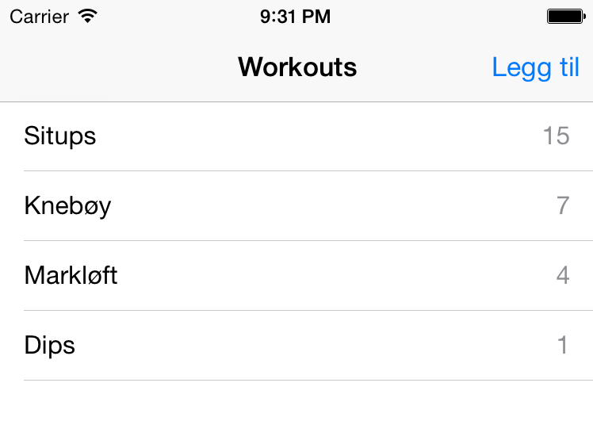

Øvingsoppgaver forelesning 10
================

Oppgave 1
----------------

Workouts er en app som lar deg legge til øvelser og telle hvor mange ganger du har utført hver øvelse. Appen skal:

* Liste ut øvelser med navn og forekomster (se bildet).
* Kunne slette øvelser
* Kunne opprette nye øvelser
* Øke antall ganger en øvelse er gjort ved tap på aktuell øvelse

Endringer skal lagres fortløpende ved hjelp av Core Data

Mye av støtten for dette finnes hvis man lager nytt prosjekt fra template - Men hvis du virkelig vil forstå det så anbefales det å starte fra en "Single View Application" og heller bruke Master/Detail som inspirasjon hvis man står fast.

Oppgave 2
----------------

* Oppdater appen til å ta ibruk NSFetchedResultsController
* Listen skal nå sorteres forløpende etter hvilken øvelse som er utført mest. Eksempel fra bildet over: tap fire ganger på markløft (slik at den blir 8), og knebøy og markløft skal nå bytte plass i lista

Opppgave 3
----------------

Lag en app som viser antallet ganger den er åpnet. Tallet skal øke med 1 hver gang den åpnes.

Implementer det på forskjellige måter:
- Bruk UserDefaults
- Bruk NSKeyedArchiver
- Bruk Keychain ( det er utrolig hemmelig hvor mange ganger appen er åpnet :-P )
- Bruk Core Data
